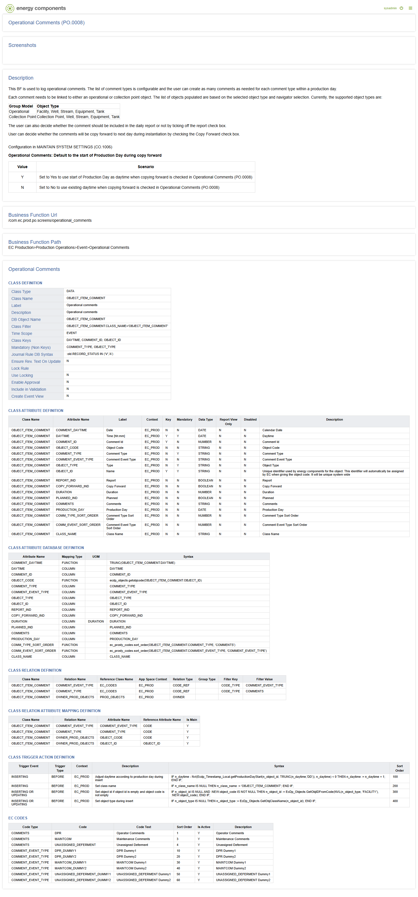

# PO.0008 - Operational Comments

_Deep-dive 2026-06-25 (deterministic runner). Module: PO._

## Identity
- BF_CODE: PO.0008 - URL: `/com.ec.prod.po.screens/operational_comments`

## DB binding (metadata-resolved)
| Class | Type/Scope | Base table | View |
|---|---|---|---|
| `OBJECT_ITEM_COMMENT` | DATA/EVENT | `OBJECT_ITEM_COMMENT` | `DV_OBJECT_ITEM_COMMENT` |

_Resolved by: label (exact, unique)_

## Screen type
DATA/EVENT

## Help (description)
This BF is used to log operational comments. The list of comment types is configurable and the user can create as many comments as needed for each comment type within a production day.

Each comment needs to be linked to either an operational or collection point object. The list of objects populated are based on the selected object type and navigator selection. Currently, the supported object types are:

Group Model	Object Type
Operational	Facility, Well, Stream, Equipment, Tank
Collection Point	Collection Point, Well, Stream, Equipment, Tank

The user can also decide whether the comment should be included in the daily report or not by ticking off the report check box.

User can decide whether the comments will be copy forward to next day during instantiation by checking the Copy Forward check box.

Configuration in MAINTAIN SYSTEM SETTINGS (CO.1006)

Operational Comments: Default to the start of Production Day during copy forward

Value
	
Scenario

Y
	Set to Yes to use start of Production Day as daytime when copying forward is checked in Operational Comments (PO.0008)

N
	Set to No to use existing daytime when copying forward is checked in Operational Comments (PO.0008)

## Help (screenshot)

