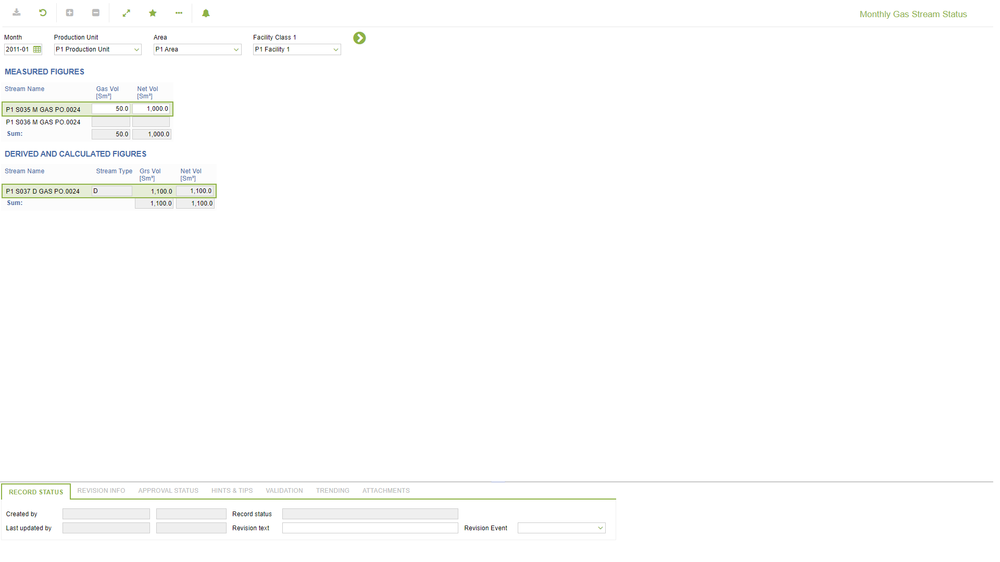

# PO.0024 - Monthly Gas Stream Status

_Deep-dive 2026-07-05 (deterministic runner). Module: PO._

## Identity
- BF_CODE: PO.0024 - URL: `/com.ec.prod.po.screens/monthly_stream_status/CLASS_NAME/STRM_GAS_MTH/CLASS_NAME_DETAIL/STRM_MTH_STREAM_DER_GAS`

## DB binding (metadata-resolved)
| Class | Type/Scope | Base table | View |
|---|---|---|---|
| `STRM_GAS_MTH` | DATA/MTH | `STRM_MTH_STREAM` | `DV_STRM_GAS_MTH` |
| `STRM_MTH_STREAM_DER_GAS` | DATA/DAY | `V_STRM_MTH_DER_STREAM` | `DV_STRM_MTH_STREAM_DER_GAS` |

_Resolved by: url CLASS_NAME_

## Screen type
DATA/MTH

## Help (screen screenshot -- local online-help corpus 14.2.5)

## Help (field-description images -- local online-help corpus 14.2.5)
_(no field-description images in corpus for this BF_CODE)_
