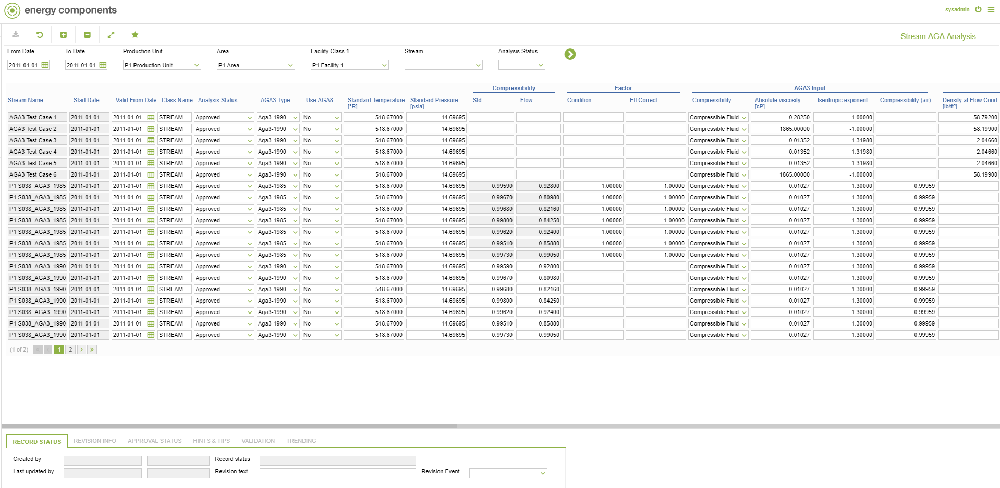
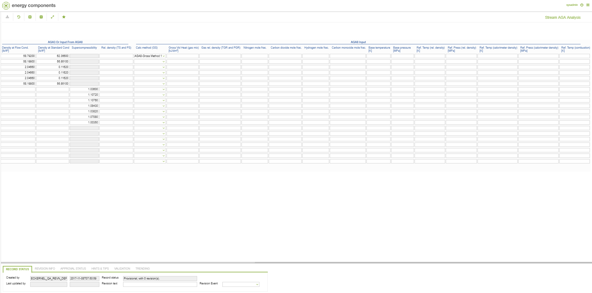

# PO.0027 - Stream AGA Analysis

_Deep-dive 2026-07-05 (deterministic runner). Module: PO._

## Identity
- BF_CODE: PO.0027 - URL: `/com.ec.prod.po.screens/stream_aga_analysis/STRM_SET/PO.0027`

## DB binding (metadata-resolved)
| Class | Type/Scope | Base table | View |
|---|---|---|---|
| `AGA_CONSTANT` | TABLE/DAY | `OBJECT_AGA_ANALYSIS` | `TV_AGA_CONSTANT` |

_Resolved by: label (exact, unique)_

## Screen type
TV (table-class)

## Help (screen screenshot -- local online-help corpus 14.2.5)

## Help (field-description images -- local online-help corpus 14.2.5)
_(no field-description images in corpus for this BF_CODE)_
