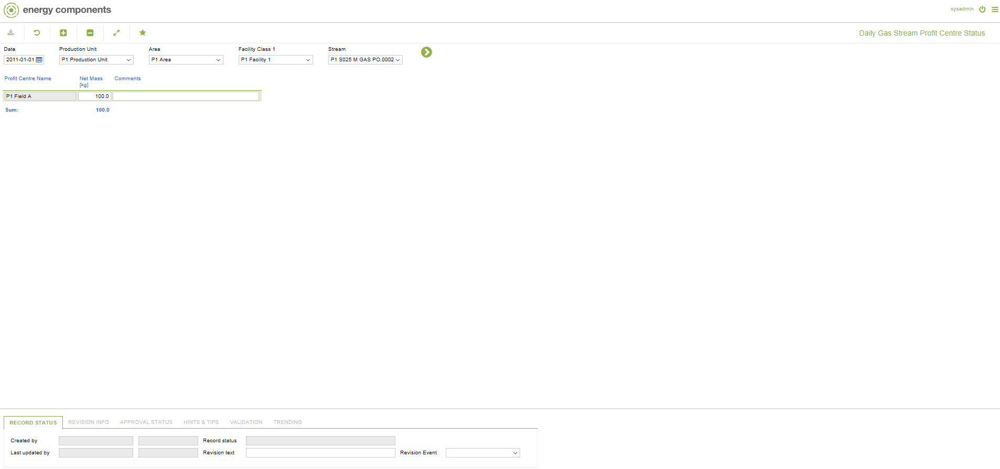

# PO.0037 - Daily Gas Stream Profit Centre Status

_Deep-dive 2026-07-05 (deterministic runner). Module: PO._

## Identity
- BF_CODE: PO.0037 - URL: `/com.ec.prod.po.screens/daily_gas_stream_profit_centre_status`

## DB binding (metadata-resolved)
| Class | Type/Scope | Base table | View |
|---|---|---|---|
| `STRM_DAY_PC_STATUS_GAS` | DATA/DAY | `STRM_DAY_PC_STATUS` | `DV_STRM_DAY_PC_STATUS_GAS` |

_Resolved by: label (exact, unique)_

## Screen type
N1 daily-status grid

## Help (screen screenshot -- local online-help corpus 14.2.5)

## Help (field-description images -- local online-help corpus 14.2.5)
_(no field-description images in corpus for this BF_CODE)_
