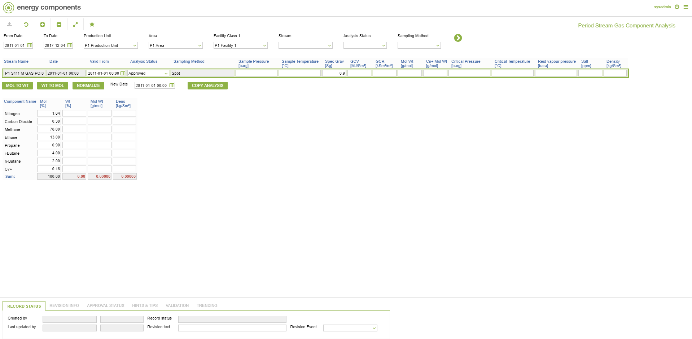

# PO.0054 - Period Stream Gas Component Analysis

_Deep-dive 2026-07-05 (deterministic runner). Module: PO._

## Identity
- BF_CODE: PO.0054 - URL: `/com.ec.prod.po.screens/period_stream_component_analysis/CLASS_NAME/STRM_GAS_ANALYSIS_EVENT/STRM_SET/PO.0054/CLASS_NAME_DETAIL/STRM_GAS_ANA_EVENT_COMP/COMP_SET/STRM_GAS_COMP/PHASE/GAS`

## DB binding (metadata-resolved)
| Class | Type/Scope | Base table | View |
|---|---|---|---|
| `STRM_GAS_ANALYSIS_EVENT` | DATA/EVENT | `STRM_ANALYSIS_EVENT` | `DV_STRM_GAS_ANALYSIS_EVENT` |
| `STRM_GAS_ANA_EVENT_COMP` | TABLE/EVENT | `STRM_ANALYSIS_COMPONENT` | `TV_STRM_GAS_ANA_EVENT_COMP` |

_Resolved by: url CLASS_NAME_

## Screen type
DATA/EVENT

## Help (screen screenshot -- local online-help corpus 14.2.5)

## Help (field-description images -- local online-help corpus 14.2.5)
_(no field-description images in corpus for this BF_CODE)_
