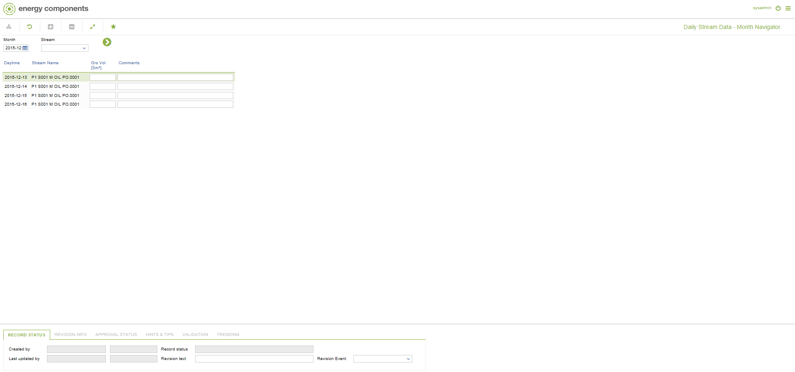

# PO.0070 - Daily Stream Data - Month Navigator

_Deep-dive 2026-07-05 (deterministic runner). Module: PO._

## Identity
- BF_CODE: PO.0070 - URL: `/com.ec.prod.po.screens/daily_stream_data_mth_nav/CLASS_NAME/STRM_DAY_STREAM_MTH_NAV/STREAM_SET/PO.0070`

## DB binding (metadata-resolved)
| Class | Type/Scope | Base table | View |
|---|---|---|---|
| `STRM_DAY_STREAM_MTH_NAV` | DATA/MTH | `STRM_DAY_STREAM` | `DV_STRM_DAY_STREAM_MTH_NAV` |

_Resolved by: url CLASS_NAME_

## Screen type
DATA/MTH

## Help (screen screenshot -- local online-help corpus 14.2.5)

## Help (field-description images -- local online-help corpus 14.2.5)
_(no field-description images in corpus for this BF_CODE)_
