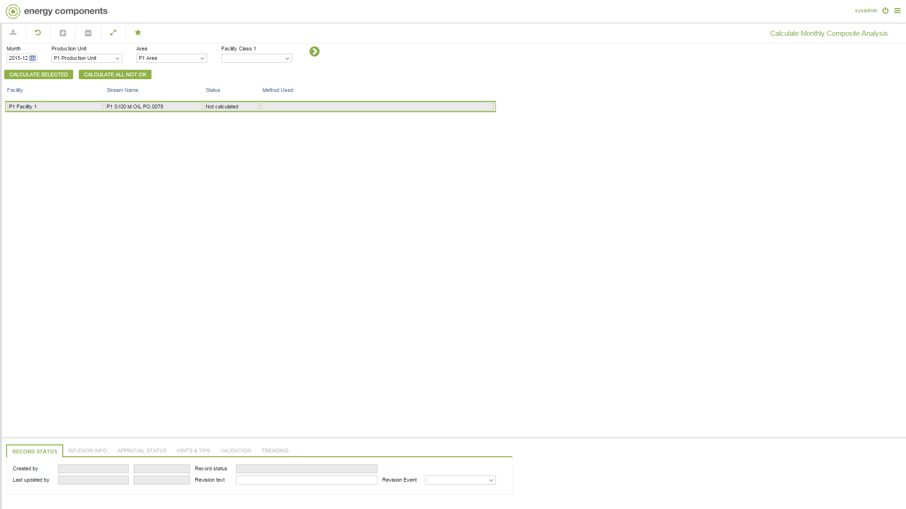

# PO.0078 - Calculate Monthly Composite Analysis

_Deep-dive 2026-07-05 (deterministic runner). Module: PO._

## Identity
- BF_CODE: PO.0078 - URL: `/com.ec.prod.po.screens/calc_mth_composite_analysis/STRM_SET/PO.0078/COMP_SET/CALC_MTH_COMP`

## DB binding (metadata-resolved)
| Class | Type/Scope | Base table | View |
|---|---|---|---|
| `MTH_COMPOSITE_ANALYSIS` | DATA/MTH | `V_STRM_COMP_ANALYSIS_STATUS` | `DV_MTH_COMPOSITE_ANALYSIS` |

_Resolved by: label (exact, unique)_

## Screen type
DATA/MTH

## Help (screen screenshot -- local online-help corpus 14.2.5)

## Help (field-description images -- local online-help corpus 14.2.5)
_(no field-description images in corpus for this BF_CODE)_
