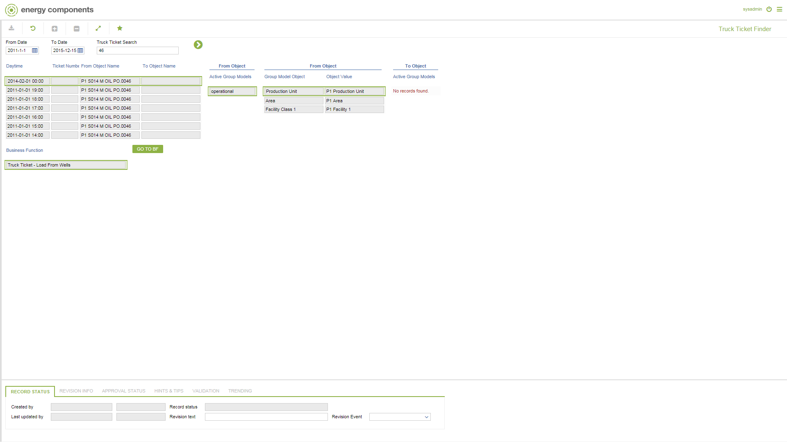

# PO.0118 - Truck Ticket Finder

_Deep-dive 2026-07-05 (deterministic runner). Module: PO._

## Identity
- BF_CODE: PO.0118 - URL: `/com.ec.prod.po.screens/truck_ticket_finder`

## DB binding (metadata-resolved)
| Class | Type/Scope | Base table | View |
|---|---|---|---|
| `TRUCK_TICKET_FINDER` | TABLE/EVENT | `V_TRUCK_TICKET_FINDER` | `TV_TRUCK_TICKET_FINDER` |

_Resolved by: url path token_

## Screen type
TV (table-class)

## Help (screen screenshot -- local online-help corpus 14.2.5)

## Help (field-description images -- local online-help corpus 14.2.5)
_(no field-description images in corpus for this BF_CODE)_
