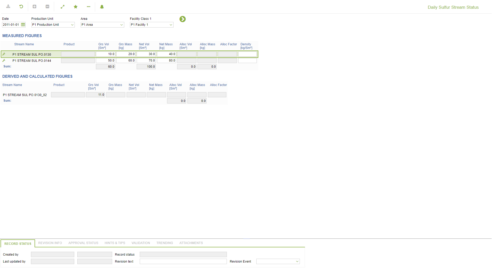
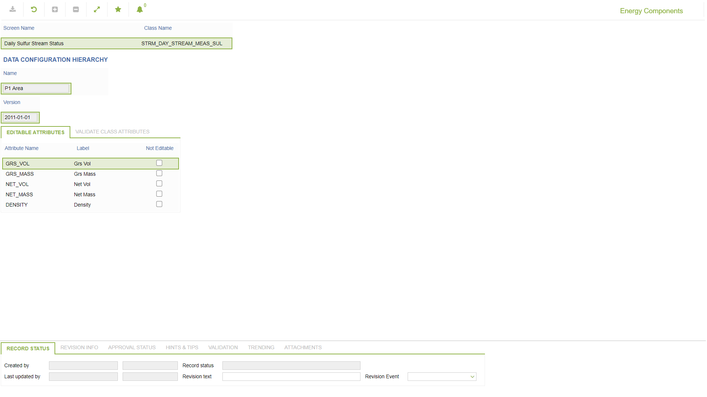

# PO.0130 - Daily Sulfur Stream Status

_Deep-dive 2026-07-05 (deterministic runner). Module: PO._

## Identity
- BF_CODE: PO.0130 - URL: `/com.ec.prod.po.screens/daily_stream_status/CLASS_NAME/STRM_DAY_STREAM_MEAS_SUL/CLASS_NAME_DETAIL/STRM_DAY_STREAM_DER_SUL`

## DB binding (metadata-resolved)
| Class | Type/Scope | Base table | View |
|---|---|---|---|
| `STRM_DAY_STREAM_MEAS_SUL` | DATA/DAY | `STRM_DAY_STREAM` | `DV_STRM_DAY_STREAM_MEAS_SUL` |
| `STRM_DAY_STREAM_DER_SUL` | DATA/DAY | `V_STRM_DAY_DER_STREAM` | `DV_STRM_DAY_STREAM_DER_SUL` |

_Resolved by: url CLASS_NAME_

## Screen type
N1 daily-status grid

## Help (screen screenshot -- local online-help corpus 14.2.5)

## Help (field-description images -- local online-help corpus 14.2.5)
_(no field-description images in corpus for this BF_CODE)_
