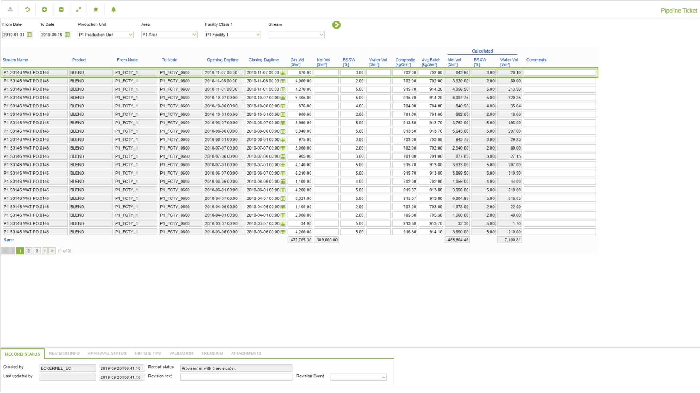

# PO.0146 - Pipeline Ticket

_Deep-dive 2026-07-05 (deterministic runner). Module: PO._

## Identity
- BF_CODE: PO.0146 - URL: `/com.ec.prod.po.screens/pipeline_ticket/CLASS_NAME/PIPELINE_TICKET/EVENT_TYPE/PIPELINE_TICKET`

## DB binding (metadata-resolved)
| Class | Type/Scope | Base table | View |
|---|---|---|---|
| `PIPELINE_TICKET` | DATA/DAY | `STRM_EVENT` | `DV_PIPELINE_TICKET` |

_Resolved by: url CLASS_NAME_

## Screen type
N1 daily-status grid

## Help (screen screenshot -- local online-help corpus 14.2.5)

## Help (field-description images -- local online-help corpus 14.2.5)
_(no field-description images in corpus for this BF_CODE)_
