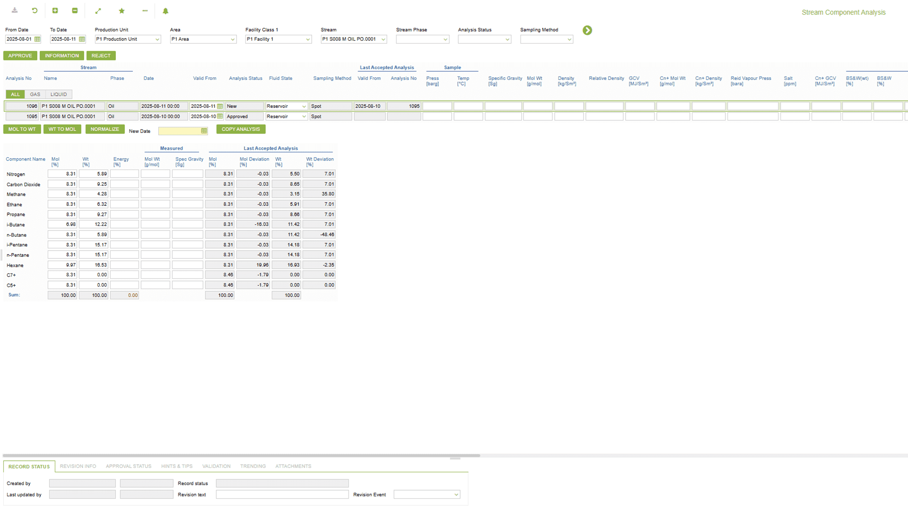
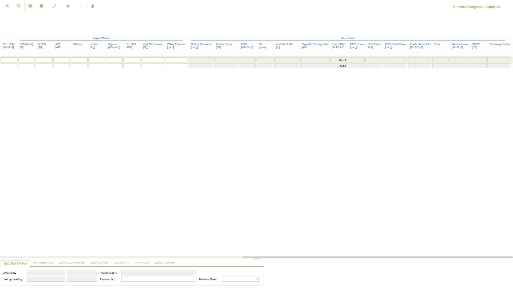
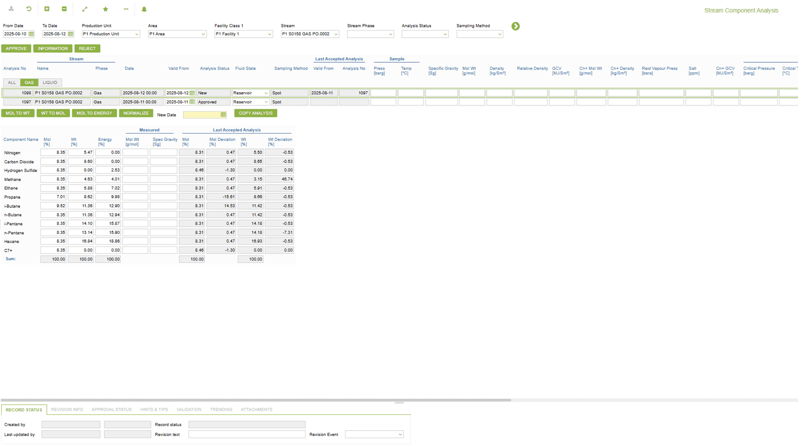
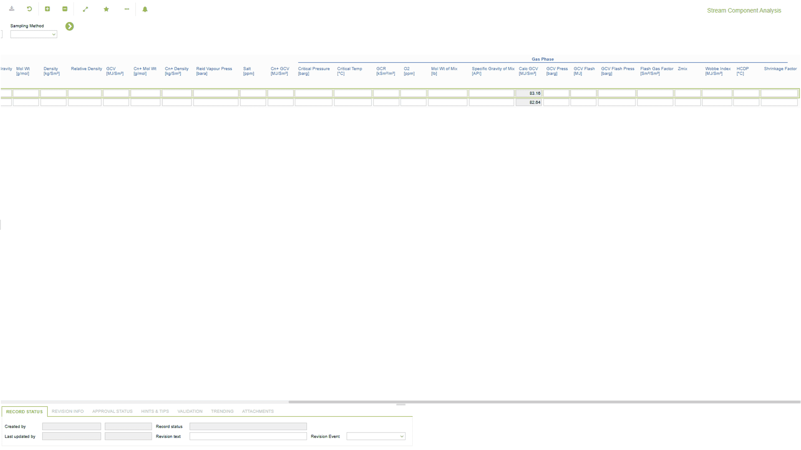
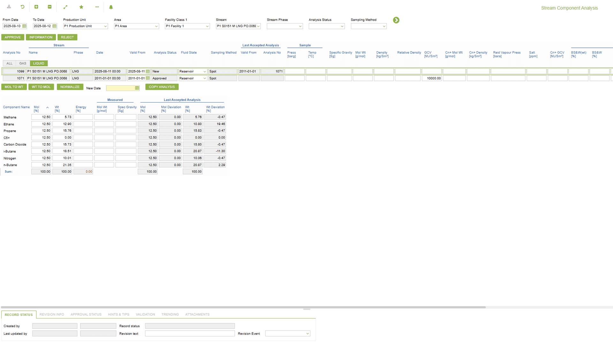
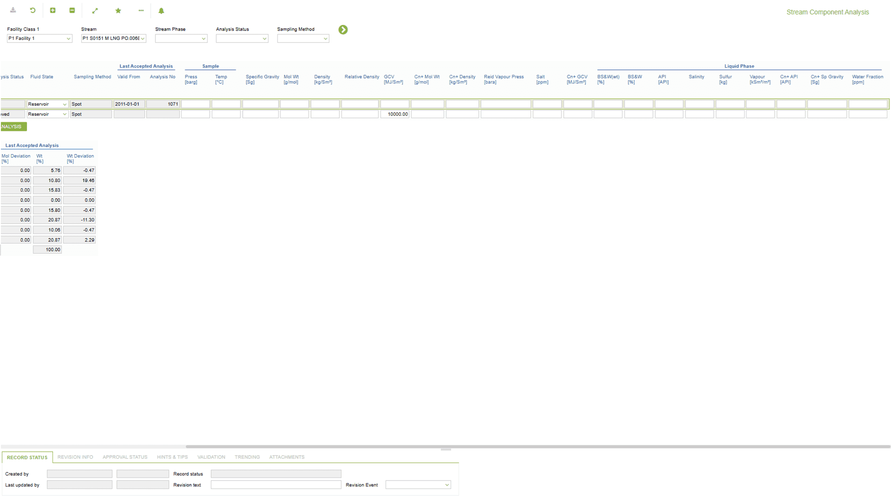

# PO.0153 - Stream Component Analysis

_Deep-dive 2026-07-05 (deterministic runner). Module: PO._

## Identity
- BF_CODE: PO.0153 - URL: `/com.ec.prod.po.screens/stream_component_analysis/STRM_SET/PO.0153/CLASS_NAME/STRM_FLUID_ANALYSIS/CLASS_NAME_2/STRM_FLUID_COMPONENT`

## DB binding (metadata-resolved)
| Class | Type/Scope | Base table | View |
|---|---|---|---|
| `STRM_FLUID_ANALYSIS` | DATA/EVENT | `OBJECT_FLUID_ANALYSIS` | `DV_STRM_FLUID_ANALYSIS` |
| `STRM_FLUID_COMPONENT` | DATA/EVENT | `FLUID_ANALYSIS_COMPONENT` | `DV_STRM_FLUID_COMPONENT` |

_Resolved by: url CLASS_NAME_

## Screen type
DATA/EVENT

## Help (screen screenshot -- local online-help corpus 14.2.5)

## Help (field-description images -- local online-help corpus 14.2.5)

