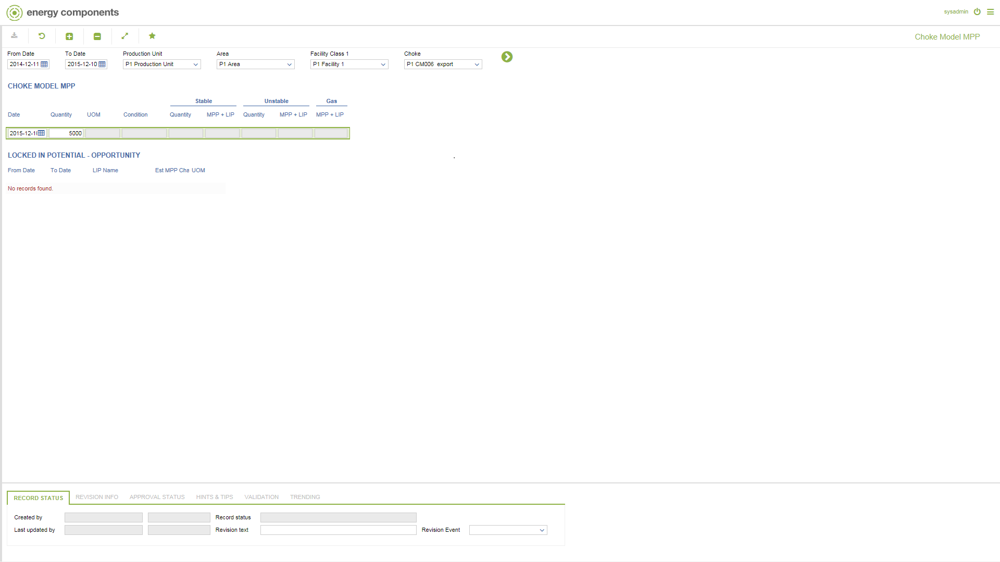

# PP.0024 - Choke Model MPP

_Deep-dive 2026-07-06 (deterministic runner). Module: PP._

## Identity
- BF_CODE: PP.0024 - URL: `/com.ec.prod.pp.screens/prod_object_potential/GROUPMODEL/CHOKE_MODEL/TARGET/CHOKE_MODEL/DATA_CLASS/CHOKE_MODEL_MPP`

## DB binding (metadata-resolved)
| Class | Type/Scope | Base table | View |
|---|---|---|---|
| `CHOKE_MODEL_MPP` | DATA/EVENT | `OBJECT_POTENTIAL` | `DV_CHOKE_MODEL_MPP` |

_Resolved by: url path token_

## Screen type
DATA/EVENT

## Help (screen screenshot -- local online-help corpus 14.2.5)

## Help (field-description images -- local online-help corpus 14.2.5)
_(no field-description images in corpus for this BF_CODE)_
