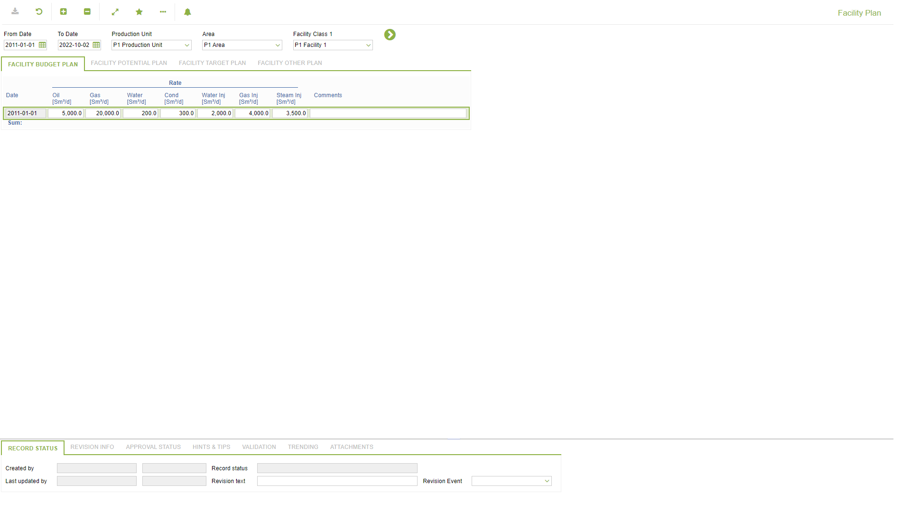
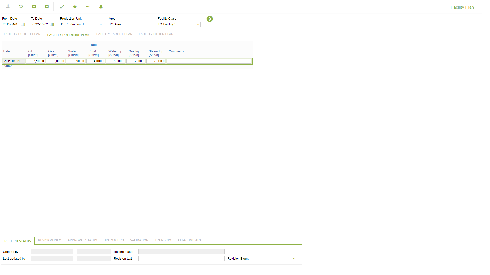
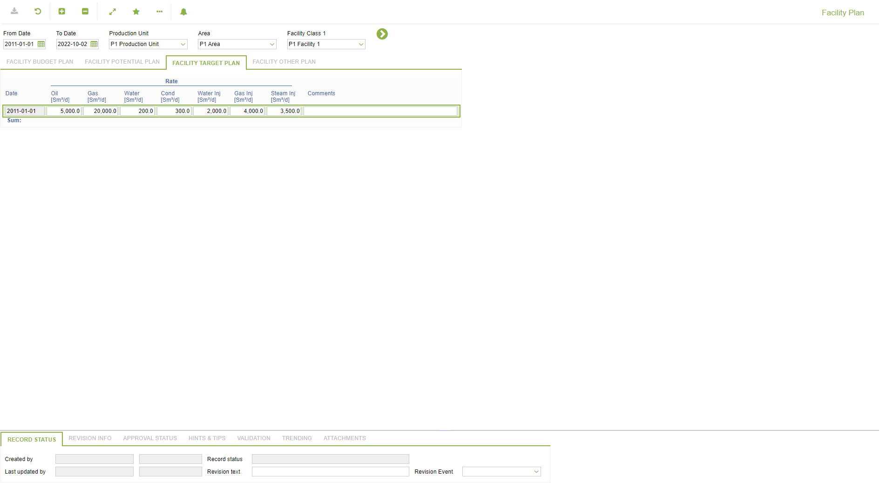
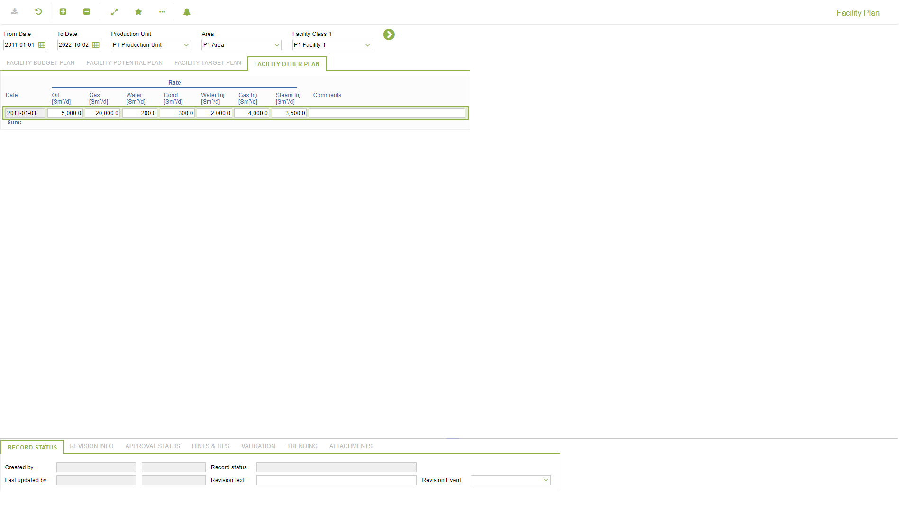

# PP.0025 - Facility Plan

_Deep-dive 2026-07-06 (deterministic runner). Module: PP._

## Identity
- BF_CODE: PP.0025 - URL: `/com.ec.prod.pp.screens/object_plan/GROUPMODEL/FACILITY/TARGET/FACILITY/DATA_CLASS_1/FCTY_PLAN_BUDGET/DATA_CLASS_2/FCTY_PLAN_POTENTIAL/DATA_CLASS_3/FCTY_PLAN_TARGET/DATA_CLASS_4/FCTY_PLAN_OTHER`

## DB binding (metadata-resolved)
| Class | Type/Scope | Base table | View |
|---|---|---|---|
| `FCTY_PLAN_OTHER` | DATA/EVENT | `OBJECT_PLAN` | `DV_FCTY_PLAN_OTHER` |

_Resolved by: url path token_

## Screen type
DATA/EVENT

## Help (screen screenshot -- local online-help corpus 14.2.5)

## Help (field-description images -- local online-help corpus 14.2.5)
_(no field-description images in corpus for this BF_CODE)_
