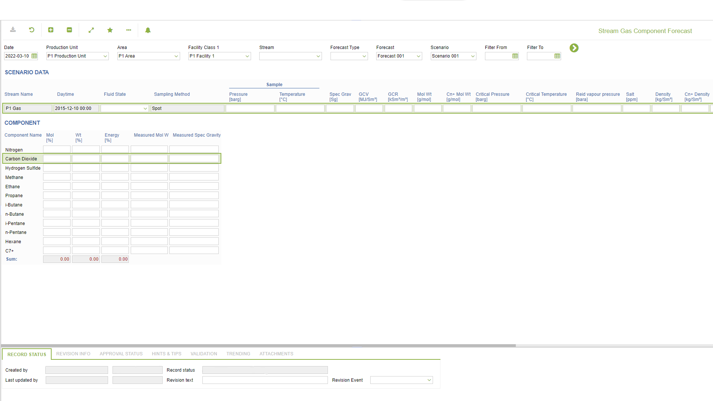
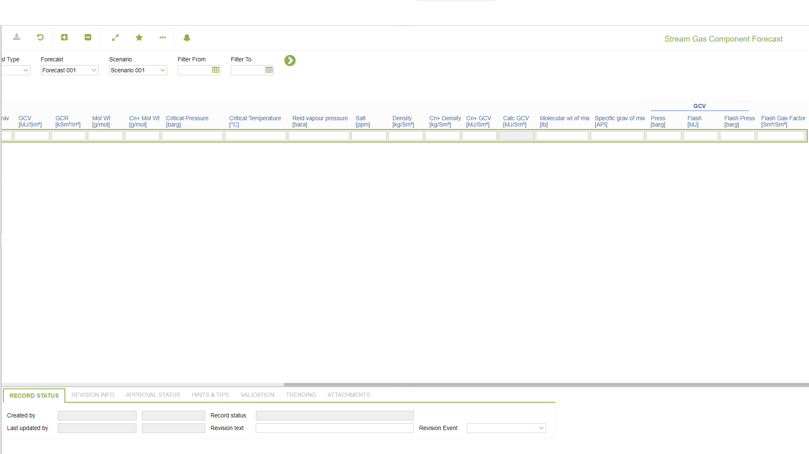

# PP.0040 - Stream Gas Component Forecast

_Deep-dive 2026-07-06 (deterministic runner). Module: PP._

## Identity
- BF_CODE: PP.0040 - URL: `/com.ec.prod.pp.screens/stream_component_forecast/CLASS_NAME/FCST_STRM_GAS/COMPONENT_SET_CLASS/FCST_STRM_GAS_COMPONENT/STRM_SET/PP.0040/COMP_SET/STRM_GAS_COMP`

## DB binding (metadata-resolved)
| Class | Type/Scope | Base table | View |
|---|---|---|---|
| `FCST_STRM_GAS` | DATA/DAY | `FCST_OBJECT_FLUID` | `DV_FCST_STRM_GAS` |

_Resolved by: url CLASS_NAME_

## Screen type
N1 daily-status grid

## Help (screen screenshot -- local online-help corpus 14.2.5)

## Help (field-description images -- local online-help corpus 14.2.5)
_(no field-description images in corpus for this BF_CODE)_
