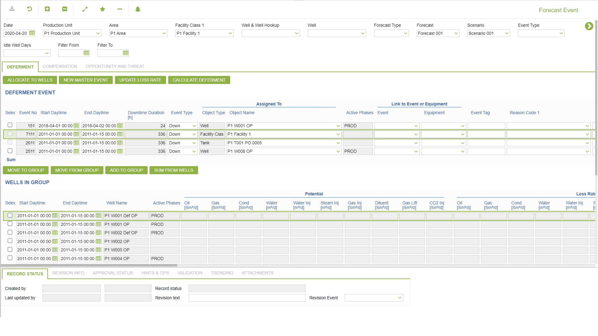
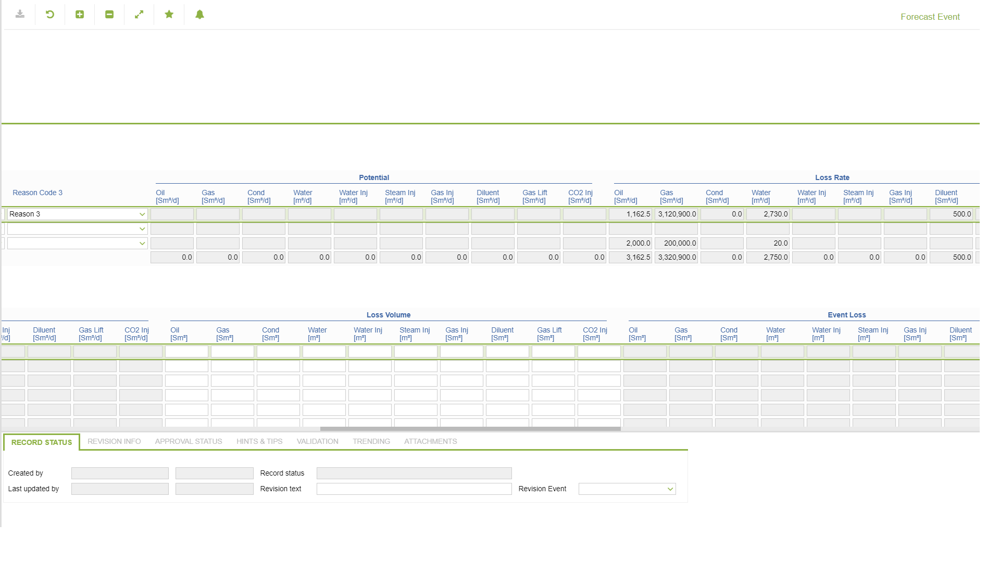
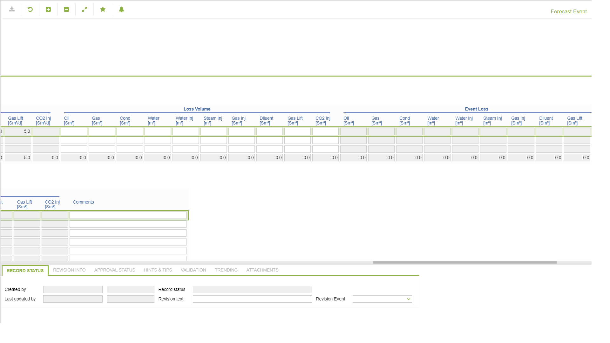
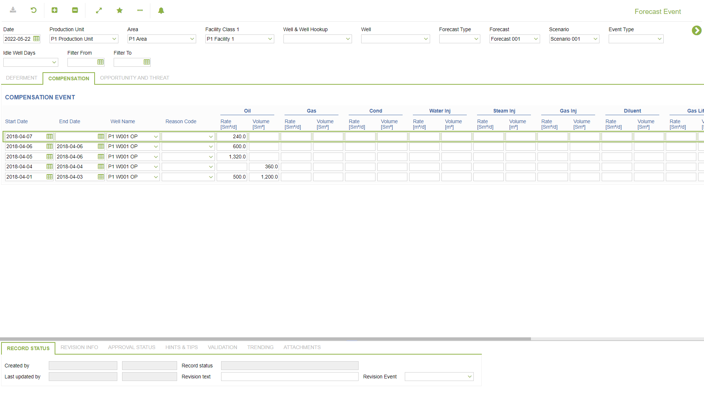
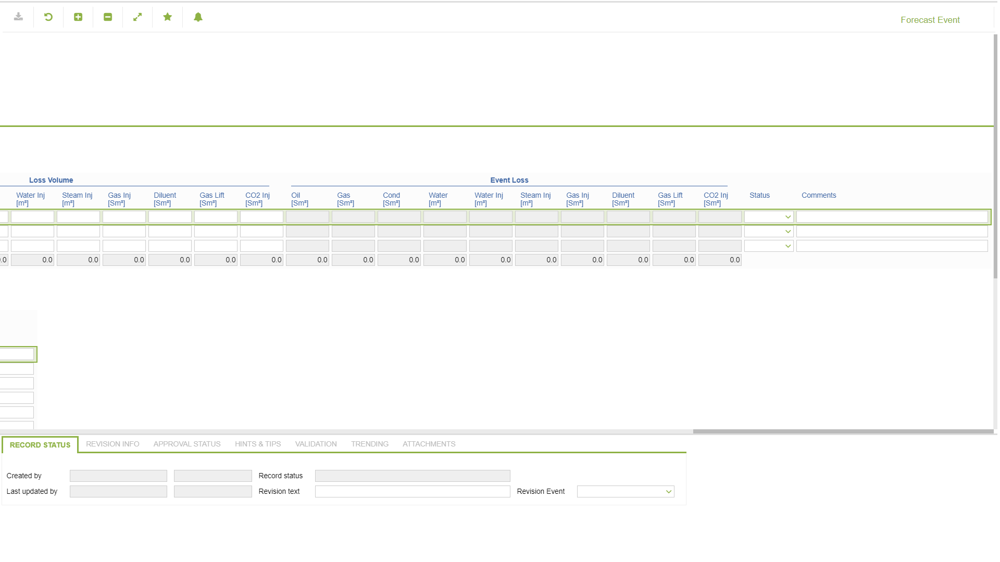
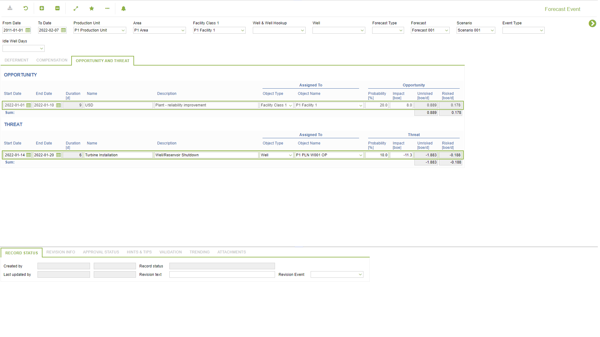

# PP.0047 - Forecast Event

_Deep-dive 2026-07-06 (deterministic runner). Module: PP._

## Identity
- BF_CODE: PP.0047 - URL: `/com.ec.prod.pp.screens/forecast_event/GROUPMODEL/WELL/CLASS_NAME/FCST_WELL_EVENT/CLASS_NAME_2/FCST_WELL_EVENT_CHILD/CLASS_NAME_3/FCST_COMPENSATION_EVENTS/CLASS_NAME_4/FCST_OPPORTUNITY/CLASS_NAME_5/FCST_THREAT/CUSTOM_PARAM/customParam`

## DB binding (metadata-resolved)
| Class | Type/Scope | Base table | View |
|---|---|---|---|
| `FCST_WELL_EVENT` | TABLE/EVENT | `FCST_WELL_EVENT` | `TV_FCST_WELL_EVENT` |
| `FCST_WELL_EVENT_CHILD` | TABLE/EVENT | `FCST_WELL_EVENT` | `TV_FCST_WELL_EVENT_CHILD` |
| `FCST_COMPENSATION_EVENTS` | DATA/EVENT | `FCST_COMPENSATION_EVENTS` | `DV_FCST_COMPENSATION_EVENTS` |
| `FCST_OPPORTUNITY` | DATA/EVENT | `FCST_OPP_THREAT` | `DV_FCST_OPPORTUNITY` |
| `FCST_THREAT` | DATA/EVENT | `FCST_OPP_THREAT` | `DV_FCST_THREAT` |

_Resolved by: url CLASS_NAME_

## Screen type
TV (table-class)

## Help (screen screenshot -- local online-help corpus 14.2.5)

## Help (field-description images -- local online-help corpus 14.2.5)
_(no field-description images in corpus for this BF_CODE)_
