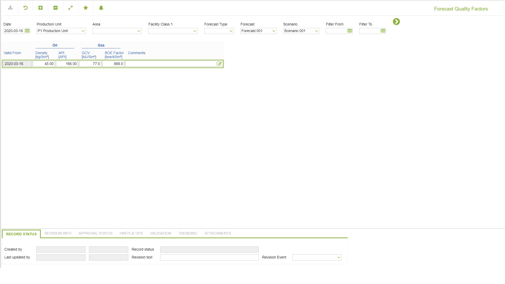

# PP.0048 - Forecast Quality Factors

_Deep-dive 2026-07-06 (deterministic runner). Module: PP._

## Identity
- BF_CODE: PP.0048 - URL: `/com.ec.prod.pp.screens/forecast_quality_factors/TARGETMANDATORY/parent/CLASS_NAME/FCST_QUALITY_FACTORS`

## DB binding (metadata-resolved)
| Class | Type/Scope | Base table | View |
|---|---|---|---|
| `FCST_QUALITY_FACTORS` | TABLE/DAY | `FCST_QUALITY_FACTORS` | `TV_FCST_QUALITY_FACTORS` |

_Resolved by: url CLASS_NAME_

## Screen type
TV (table-class)

## Help (screen screenshot -- local online-help corpus 14.2.5)

## Help (field-description images -- local online-help corpus 14.2.5)
_(no field-description images in corpus for this BF_CODE)_
