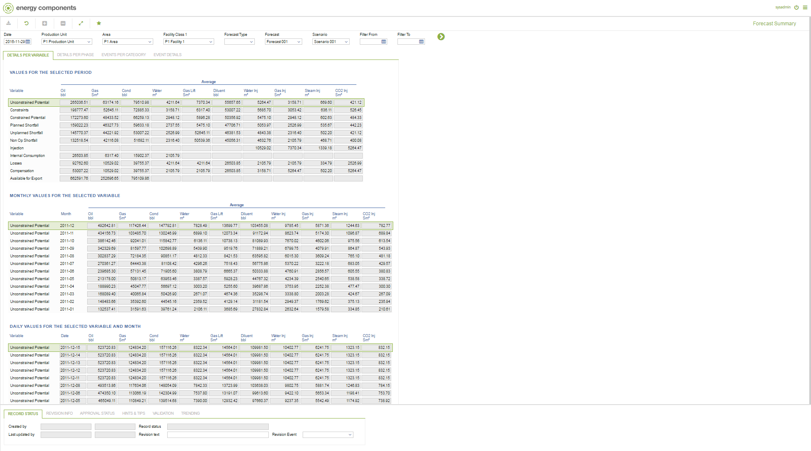
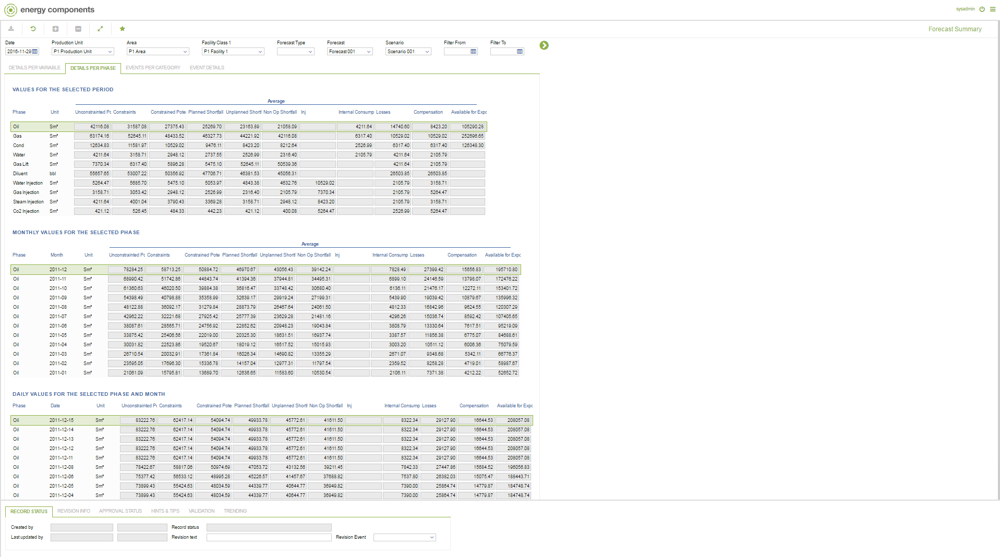
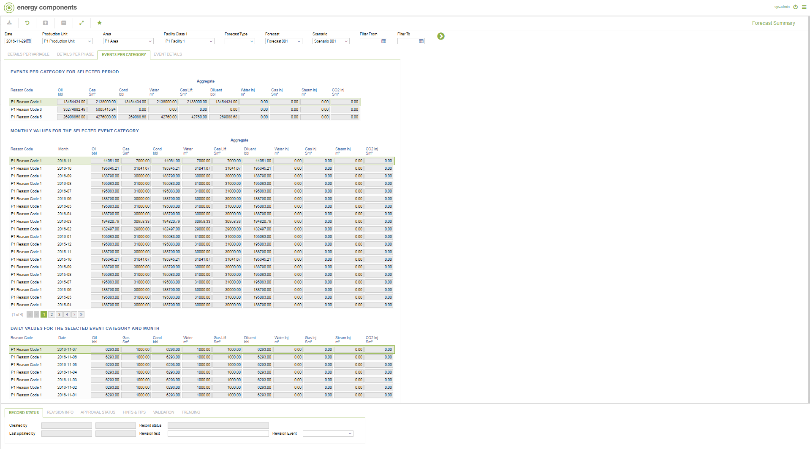
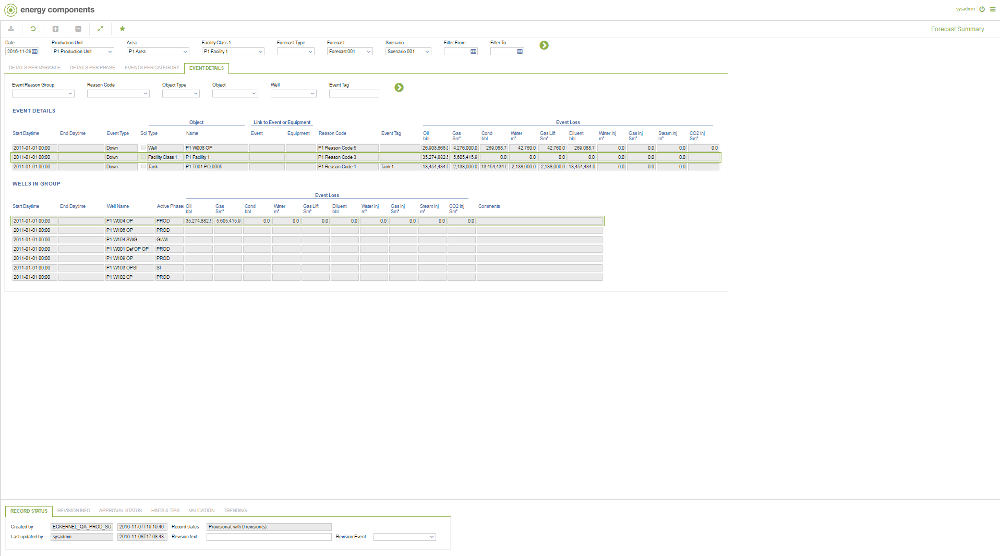

# PP.0052 - Forecast Summary

_Deep-dive 2026-07-06 (deterministic runner). Module: PP._

## Identity
- BF_CODE: PP.0052 - URL: `/com.ec.prod.pp.screens/forecast_summary/TARGETMANDATORY/parent/CLASS_NAME_VARIABLE_1/FCST_SUMM_VAR/CLASS_NAME_VARIABLE_2/FCST_SUMM_VAR_MTH/CLASS_NAME_VARIABLE_3/FCST_SUMM_VAR_DAY/CLASS_NAME_PHASE_1/FCST_SUMM_PHASE/CLASS_NAME_PHASE_2/FCST_SUMM_PHASE_MTH/CLASS_NAME_PHASE_3/FCST_SUMM_PHASE_DAY/CLASS_NAME_CATEGORY_1/FCST_SUMM_REASON/CLASS_NAME_CATEGORY_2/FCST_SUMM_REASON_MTH/CLASS_NAME_CATEGORY_3/FCST_SUMM_REASON_DAY/CLASS_NAME_EVENT_1/FCST_SUMM_EVENT_DETAILS/CLASS_NAME_EVENT_CHILD/FCST_SUMM_EVENT_CHILD`

## DB binding (metadata-resolved)
| Class | Type/Scope | Base table | View |
|---|---|---|---|
| `FCST_SUMM_VAR` | TABLE/EVENT | `V_FCST_SUMM_VAR` | `TV_FCST_SUMM_VAR` |
| `FCST_SUMM_VAR_MTH` | TABLE/EVENT | `V_FCST_SUMM_VAR_MTH` | `TV_FCST_SUMM_VAR_MTH` |
| `FCST_SUMM_VAR_DAY` | TABLE/EVENT | `V_FCST_SUMM_VAR_DAY` | `TV_FCST_SUMM_VAR_DAY` |
| `FCST_SUMM_PHASE` | TABLE/EVENT | `V_FCST_SUMM_PHASE` | `TV_FCST_SUMM_PHASE` |
| `FCST_SUMM_PHASE_MTH` | TABLE/EVENT | `V_FCST_SUMM_PHASE_MTH` | `TV_FCST_SUMM_PHASE_MTH` |
| `FCST_SUMM_PHASE_DAY` | TABLE/EVENT | `V_FCST_SUMM_PHASE_DAY` | `TV_FCST_SUMM_PHASE_DAY` |
| `FCST_SUMM_REASON` | TABLE/EVENT | `V_FCST_SUMM_REASON` | `TV_FCST_SUMM_REASON` |
| `FCST_SUMM_REASON_MTH` | TABLE/EVENT | `V_FCST_SUMM_REASON_MTH` | `TV_FCST_SUMM_REASON_MTH` |
| `FCST_SUMM_REASON_DAY` | TABLE/EVENT | `V_FCST_SUMM_REASON_DAY` | `TV_FCST_SUMM_REASON_DAY` |
| `FCST_SUMM_EVENT_DETAILS` | TABLE/EVENT | `FCST_WELL_EVENT` | `TV_FCST_SUMM_EVENT_DETAILS` |
| `FCST_SUMM_EVENT_CHILD` | TABLE/EVENT | `FCST_WELL_EVENT` | `TV_FCST_SUMM_EVENT_CHILD` |

_Resolved by: url CLASS_NAME_

## Screen type
TV (table-class)

## Help (screen screenshot -- local online-help corpus 14.2.5)

## Help (field-description images -- local online-help corpus 14.2.5)
_(no field-description images in corpus for this BF_CODE)_
