# PP.0054 - Forecast Production

_Deep-dive 2026-07-06 (deterministic runner). Module: PP._

## Identity
- BF_CODE: PP.0054 - URL: `/com.ec.prod.pp.screens/fcst_production/TARGETMANDATORY/parent/OIL/FCST_PROD_OIL/COND/FCST_PROD_COND/GAS/FCST_PROD_GAS/WATER/FCST_PROD_WAT/BOE/FCST_PROD_BOE`

## DB binding (metadata-resolved)
| Class | Type/Scope | Base table | View |
|---|---|---|---|
| `FCST_PROD_BOE` | DATA/DAY | `FCST_SUMMARY_DAY` | `DV_FCST_PROD_BOE` |

_Resolved by: url path token_

## Screen type
N1 daily-status grid

## Help (screen screenshot -- local online-help corpus 14.2.5)

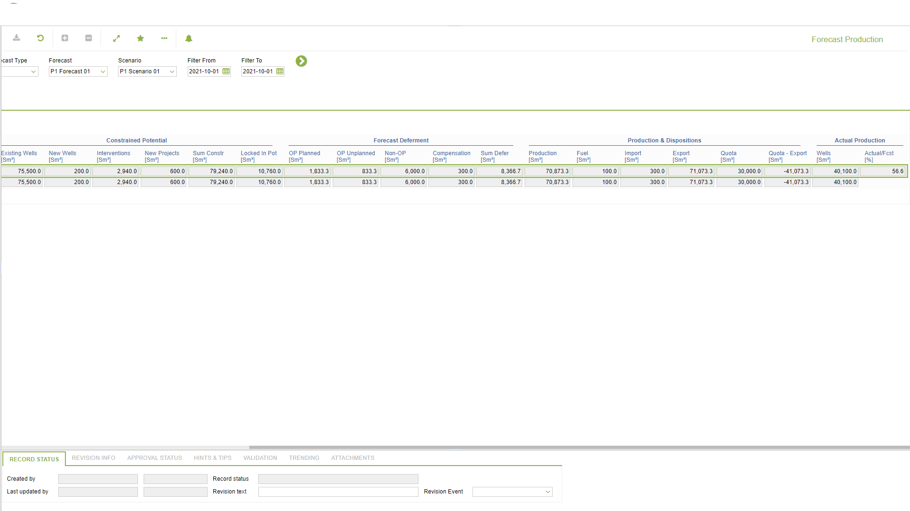
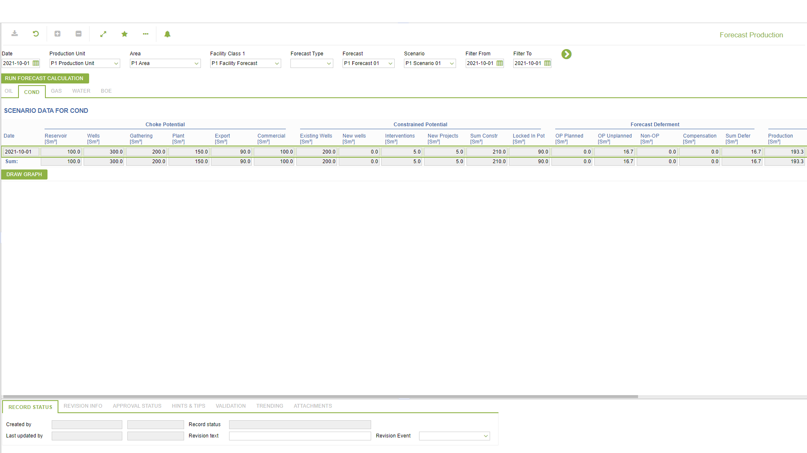
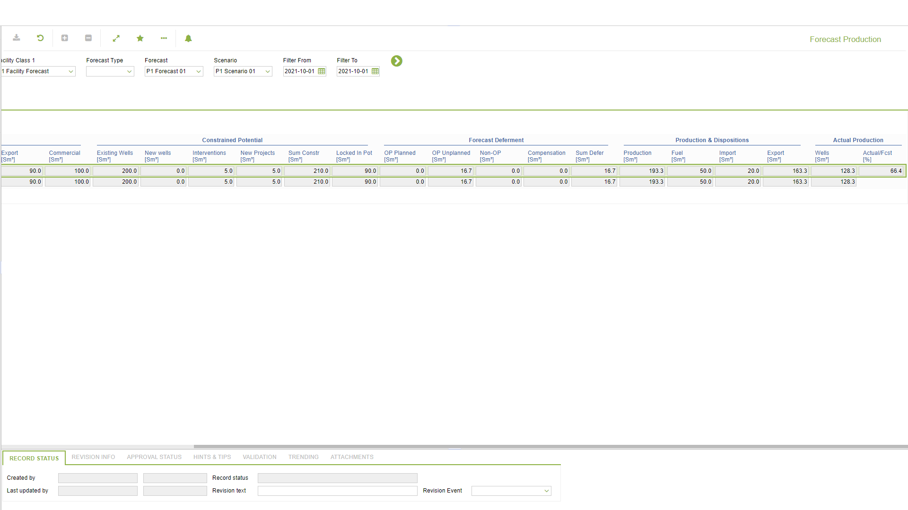
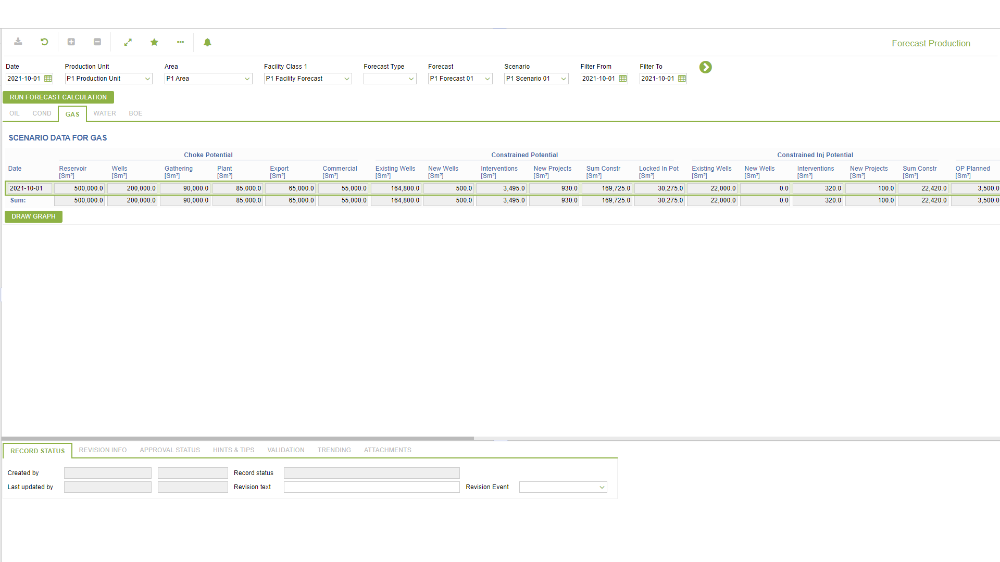
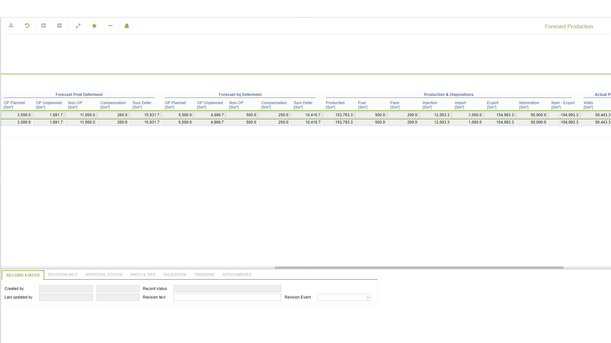
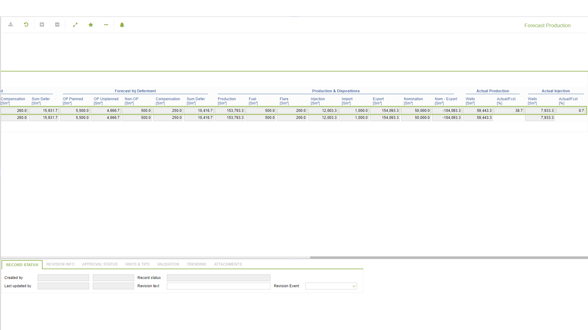
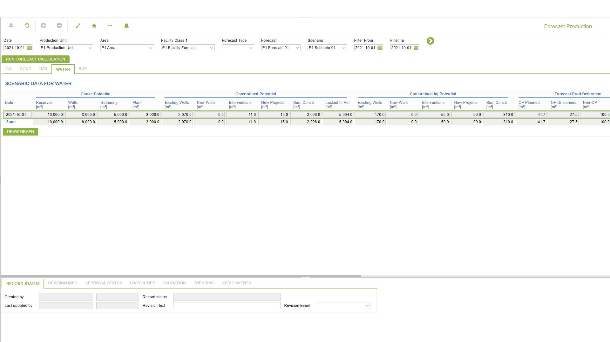
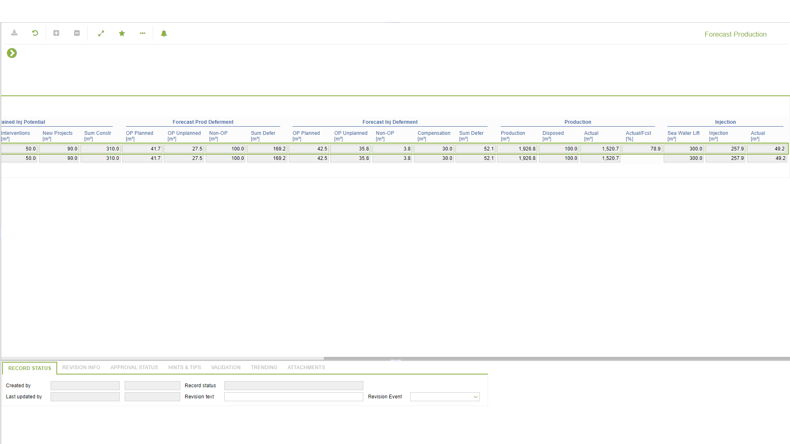
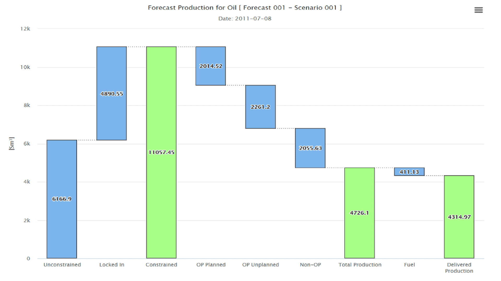
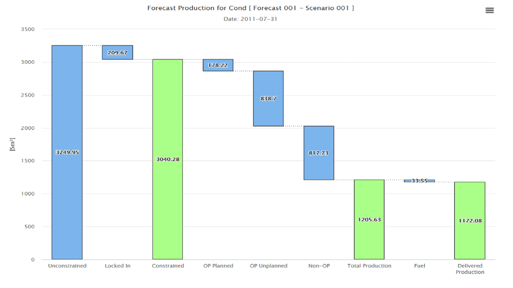
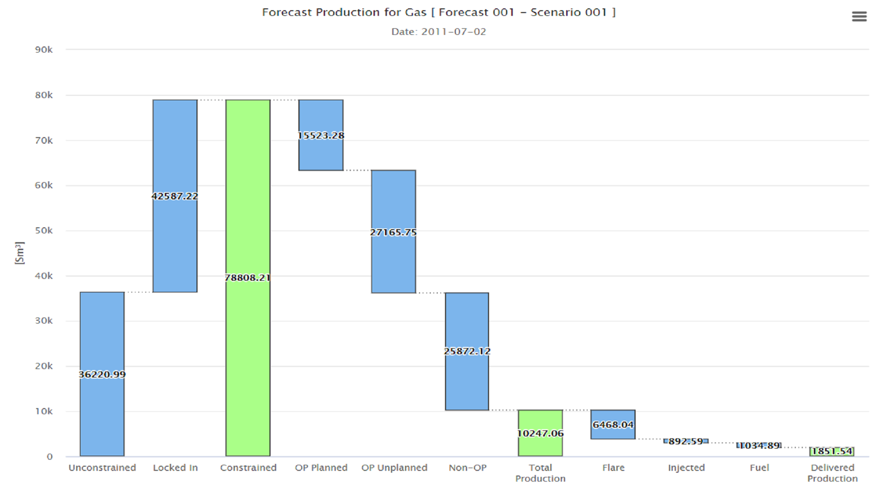
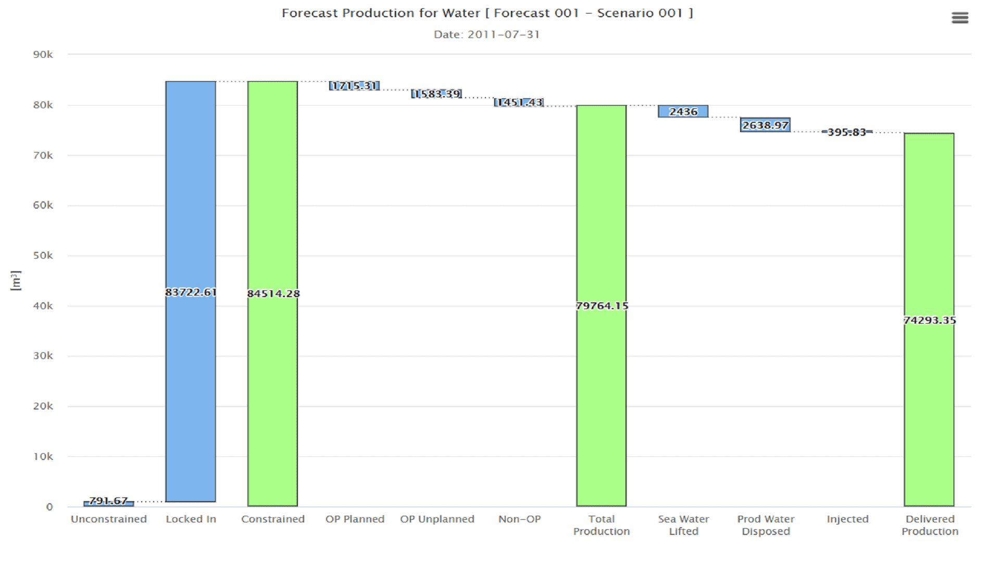
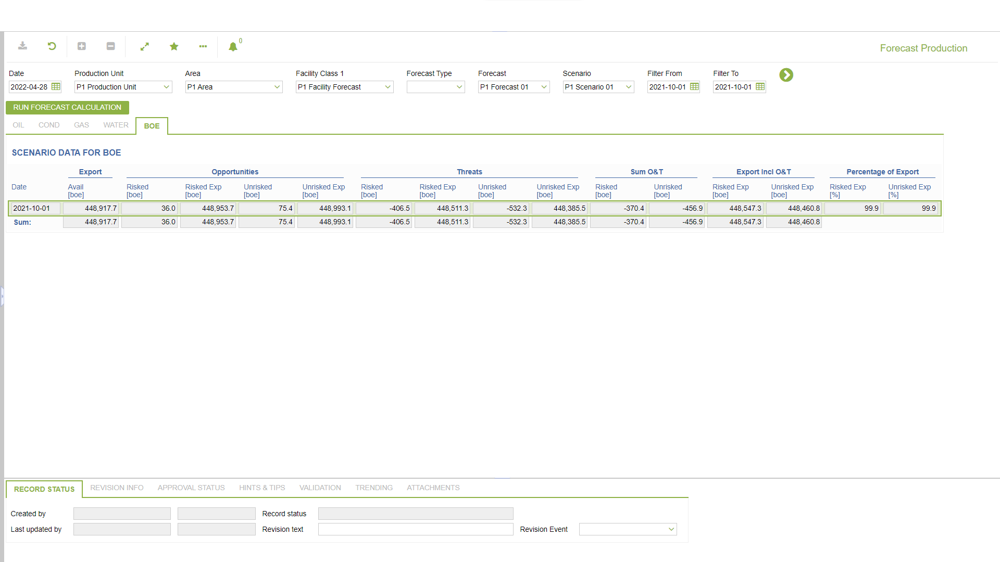

## Help (field-description images -- local online-help corpus 14.2.5)
_(no field-description images in corpus for this BF_CODE)_
