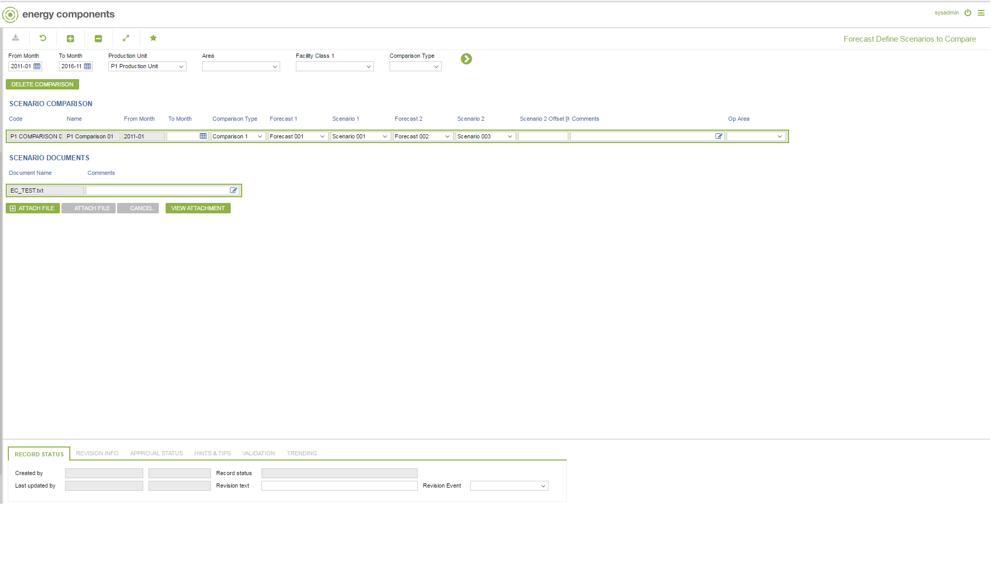

# PP.0056 - Forecast Define Scenarios to Compare

_Deep-dive 2026-07-06 (deterministic runner). Module: PP._

## Identity
- BF_CODE: PP.0056 - URL: `/com.ec.prod.pp.screens/forecast_define_scenarios/GROUPMODEL/FORECAST_GROUP/TARGET/FORECAST_GROUP/TARGETMANDATORY/parent/CLASS_NAME/FORECAST_COMPARISON/CLASS_NAME_2/FCST_COMPARE_DOCUMENTS`

## DB binding (metadata-resolved)
| Class | Type/Scope | Base table | View |
|---|---|---|---|
| `FORECAST_COMPARISON` | OBJECT/VERSIONED | `FCST_COMPARISON` | `OV_FORECAST_COMPARISON` |
| `FCST_COMPARE_DOCUMENTS` | TABLE/DAY | `FORECAST_DOCUMENTS` | `TV_FCST_COMPARE_DOCUMENTS` |

_Resolved by: url CLASS_NAME_

## Screen type
OV (master-data object)

## Help (screen screenshot -- local online-help corpus 14.2.5)

## Help (field-description images -- local online-help corpus 14.2.5)
_(no field-description images in corpus for this BF_CODE)_
