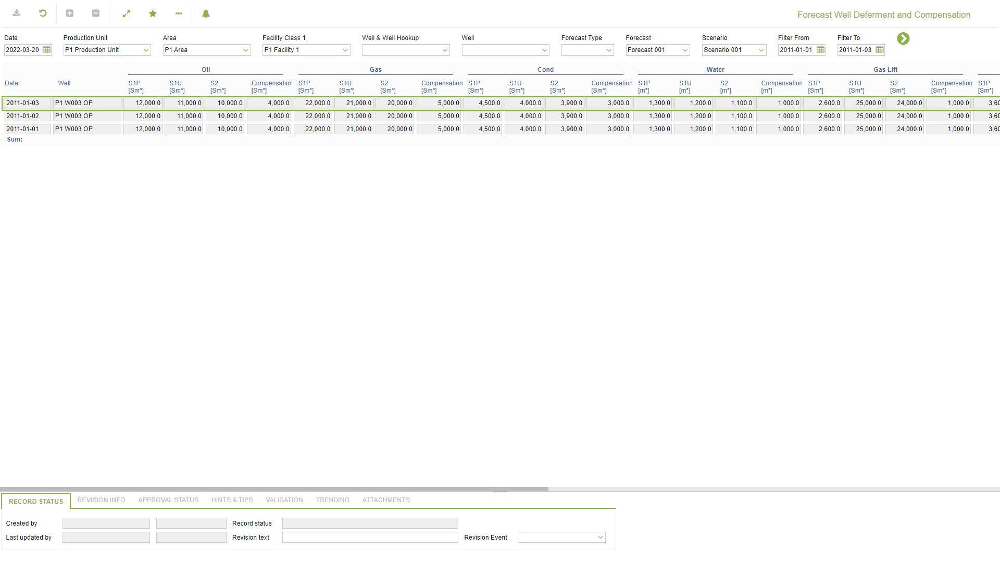
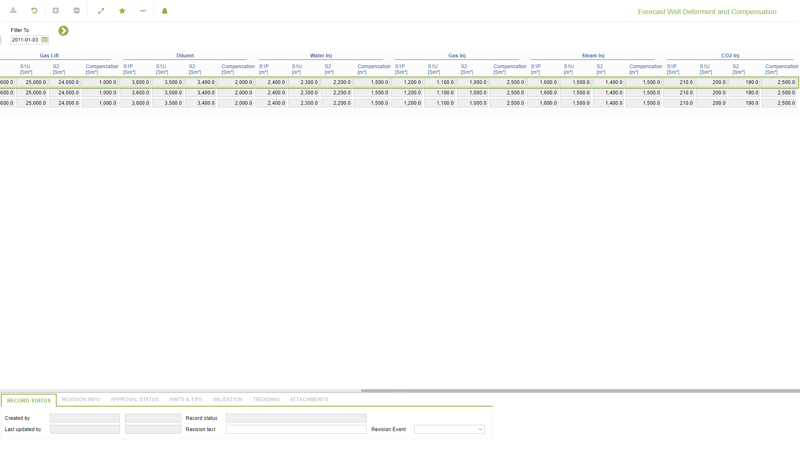

# PP.0059 - Forecast Well Deferment and Compensation

_Deep-dive 2026-07-06 (deterministic runner). Module: PP._

## Identity
- BF_CODE: PP.0059 - URL: `/com.ec.prod.pp.screens/daily_well_forecast_compensation/TARGETMANDATORY/parent/GROUPMODEL/WELL/CLASS_NAME/FCST_WELL_SUMMARY_DAY`

## DB binding (metadata-resolved)
| Class | Type/Scope | Base table | View |
|---|---|---|---|
| `FCST_WELL_SUMMARY_DAY` | DATA/DAY | `FCST_WELL_SUMMARY_DAY` | `DV_FCST_WELL_SUMMARY_DAY` |

_Resolved by: url CLASS_NAME_

## Screen type
N1 daily-status grid

## Help (screen screenshot -- local online-help corpus 14.2.5)

## Help (field-description images -- local online-help corpus 14.2.5)
_(no field-description images in corpus for this BF_CODE)_
