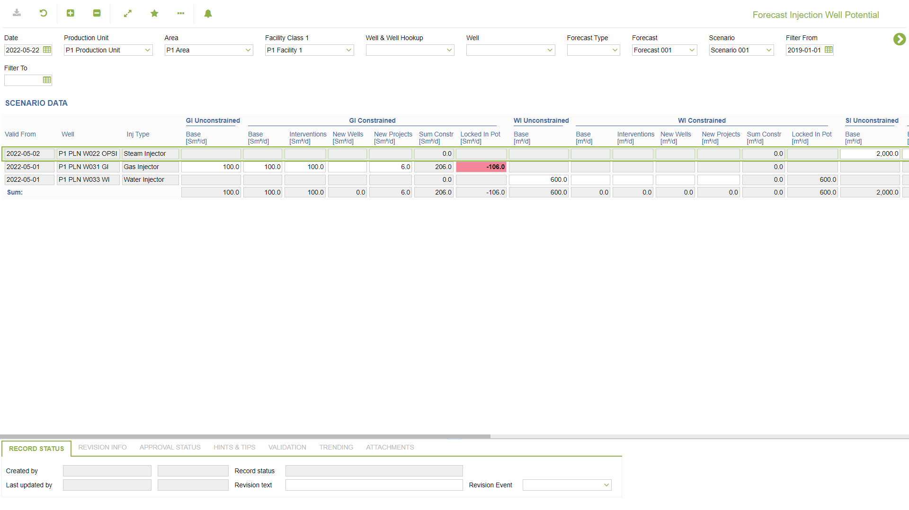
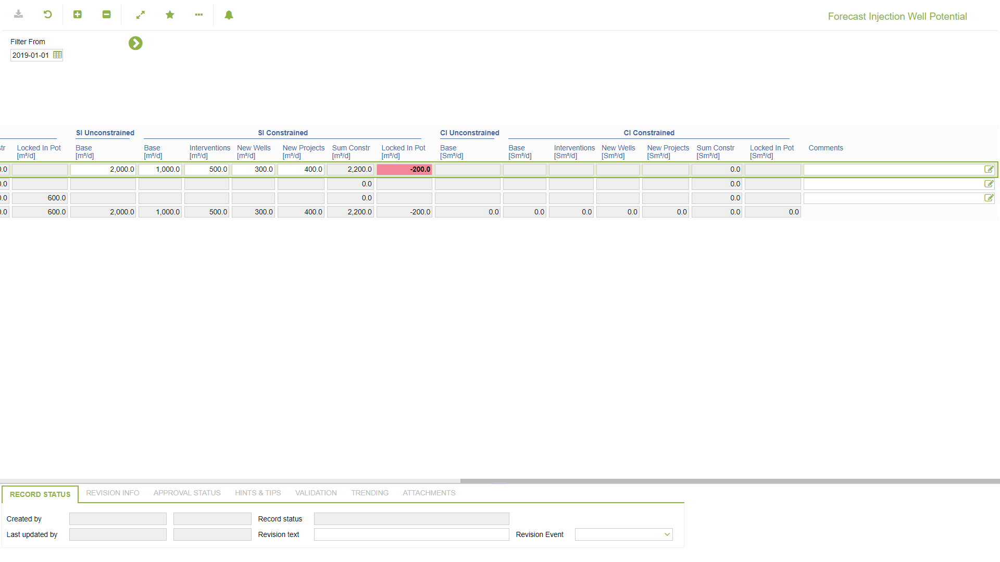

# PP.0060 - Forecast Injection Well Potential

_Deep-dive 2026-07-06 (deterministic runner). Module: PP._

## Identity
- BF_CODE: PP.0060 - URL: `/com.ec.prod.pp.screens/daily_injection_forecast/TARGETMANDATORY/parent/GROUPMODEL/WELL/CLASS_NAME/FCST_IWEL_POTENTIAL/INJ_TYPE/Y`

## DB binding (metadata-resolved)
| Class | Type/Scope | Base table | View |
|---|---|---|---|
| `FCST_IWEL_POTENTIAL` | DATA/EVENT | `FCST_IWEL_POTENTIAL` | `DV_FCST_IWEL_POTENTIAL` |

_Resolved by: url CLASS_NAME_

## Screen type
DATA/EVENT

## Help (screen screenshot -- local online-help corpus 14.2.5)

## Help (field-description images -- local online-help corpus 14.2.5)
_(no field-description images in corpus for this BF_CODE)_
