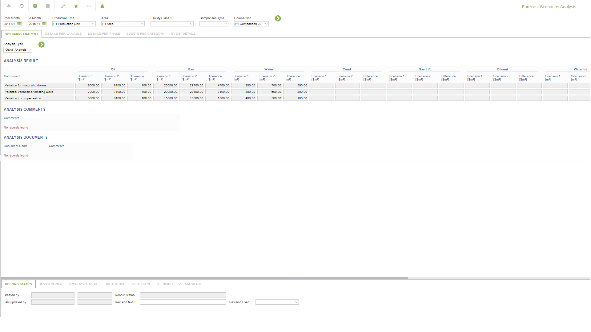
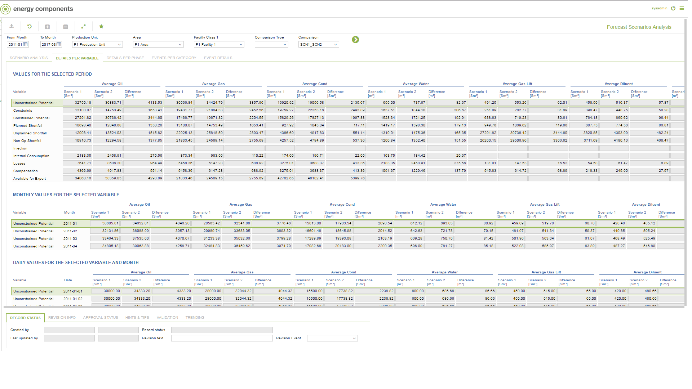
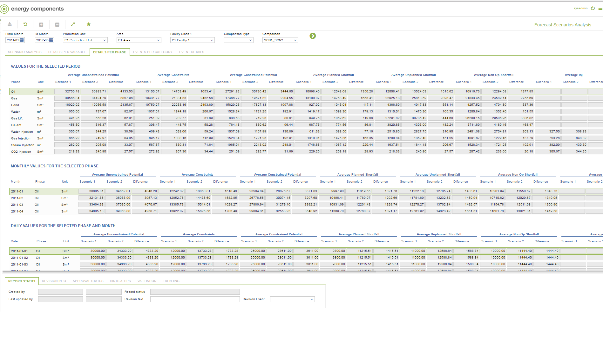
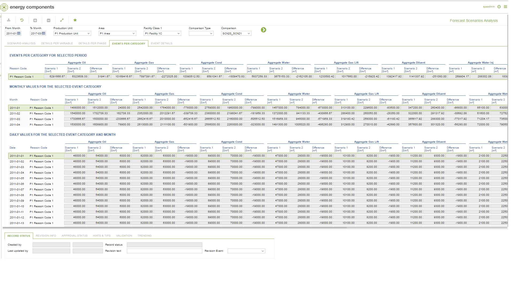
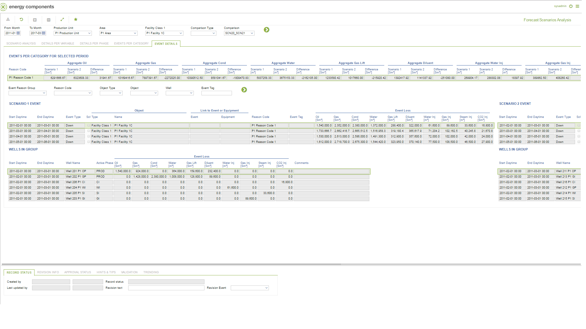
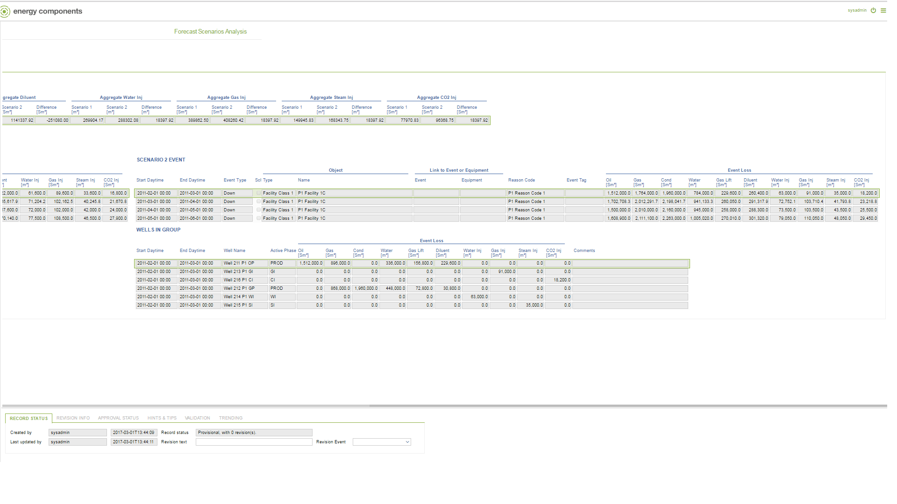

# PP.0061 - Forecast Scenarios Analysis

_Deep-dive 2026-07-06 (deterministic runner). Module: PP._

## Identity
- BF_CODE: PP.0061 - URL: `/com.ec.prod.pp.screens/forecast_scenarios_analysis/TARGETMANDATORY/parent/CLASS_NAME_ANALYSIS_1/FCST_SCENARIO_ANALYSIS/CLASS_NAME_ANALYSIS_2/FCST_ANALYSIS_COMMENT/CLASS_NAME_ANALYSIS_3/FCST_ANALYSIS_DOCUMENTS/CLASS_NAME_VARIABLE_1/FCST_SUMM_VAR_CPR/CLASS_NAME_VARIABLE_2/FCST_SUMM_VAR_MTH_CPR/CLASS_NAME_VARIABLE_3/FCST_SUMM_VAR_DAY_CPR/CLASS_NAME_PHASE_1/FCST_SUMM_PHASE_CPR/CLASS_NAME_PHASE_2/FCST_SUMM_PHASE_MTH_CPR/CLASS_NAME_PHASE_3/FCST_SUMM_PHASE_DAY_CPR/CLASS_NAME_EVENT_1/FCST_SUMM_REASON_CPR/CLASS_NAME_EVENT_2/FCST_SUMM_REASON_MTH_CPR/CLASS_NAME_EVENT_3/FCST_SUMM_REASON_DAY_CPR/CLASS_NAME_EVENT_DETAILS_1/FCST_SUMM_REASON_CPR/CLASS_NAME_EVENT_DETAILS_2/FCST_SUMM_EVENT_DETAILS/CLASS_NAME_EVENT_DETAILS_3/FCST_SUMM_EVENT_CHILD`

## DB binding (metadata-resolved)
| Class | Type/Scope | Base table | View |
|---|---|---|---|
| `FCST_SCENARIO_ANALYSIS` | DATA/EVENT | `FCST_SCENARIO_ANALYSIS` | `DV_FCST_SCENARIO_ANALYSIS` |
| `FCST_ANALYSIS_COMMENT` | DATA/EVENT | `FCST_ANALYSIS_COMMENT` | `DV_FCST_ANALYSIS_COMMENT` |
| `FCST_ANALYSIS_DOCUMENTS` | TABLE/DAY | `FORECAST_DOCUMENTS` | `TV_FCST_ANALYSIS_DOCUMENTS` |
| `FCST_SUMM_VAR_CPR` | TABLE/EVENT | `V_FCST_SUMM_VAR_CPR` | `TV_FCST_SUMM_VAR_CPR` |
| `FCST_SUMM_VAR_MTH_CPR` | TABLE/EVENT | `V_FCST_SUMM_VAR_MTH_CPR` | `TV_FCST_SUMM_VAR_MTH_CPR` |
| `FCST_SUMM_VAR_DAY_CPR` | TABLE/EVENT | `V_FCST_SUMM_VAR_DAY_CPR` | `TV_FCST_SUMM_VAR_DAY_CPR` |
| `FCST_SUMM_PHASE_CPR` | TABLE/EVENT | `V_FCST_SUMM_PHASE_CPR` | `TV_FCST_SUMM_PHASE_CPR` |
| `FCST_SUMM_PHASE_MTH_CPR` | TABLE/EVENT | `V_FCST_SUMM_PHASE_MTH_CPR` | `TV_FCST_SUMM_PHASE_MTH_CPR` |
| `FCST_SUMM_PHASE_DAY_CPR` | TABLE/EVENT | `V_FCST_SUMM_PHASE_DAY_CPR` | `TV_FCST_SUMM_PHASE_DAY_CPR` |
| `FCST_SUMM_REASON_CPR` | TABLE/EVENT | `V_FCST_SUMM_REASON_CPR` | `TV_FCST_SUMM_REASON_CPR` |
| `FCST_SUMM_REASON_MTH_CPR` | TABLE/EVENT | `V_FCST_SUMM_REASON_MTH_CPR` | `TV_FCST_SUMM_REASON_MTH_CPR` |
| `FCST_SUMM_REASON_DAY_CPR` | TABLE/EVENT | `V_FCST_SUMM_REASON_DAY_CPR` | `TV_FCST_SUMM_REASON_DAY_CPR` |
| `FCST_SUMM_REASON_CPR` | TABLE/EVENT | `V_FCST_SUMM_REASON_CPR` | `TV_FCST_SUMM_REASON_CPR` |
| `FCST_SUMM_EVENT_DETAILS` | TABLE/EVENT | `FCST_WELL_EVENT` | `TV_FCST_SUMM_EVENT_DETAILS` |
| `FCST_SUMM_EVENT_CHILD` | TABLE/EVENT | `FCST_WELL_EVENT` | `TV_FCST_SUMM_EVENT_CHILD` |

_Resolved by: url CLASS_NAME_

## Screen type
DATA/EVENT

## Help (screen screenshot -- local online-help corpus 14.2.5)

## Help (field-description images -- local online-help corpus 14.2.5)
_(no field-description images in corpus for this BF_CODE)_
