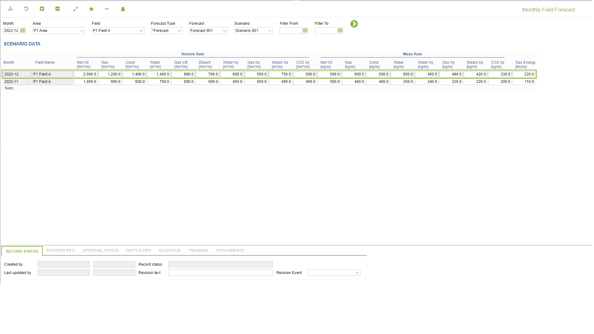

# PP.0063 - Monthly Field Forecast

_Deep-dive 2026-07-06 (deterministic runner). Module: PP._

## Identity
- BF_CODE: PP.0063 - URL: `/com.ec.prod.pp.screens/monthly_field_forecast/CLASS_NAME/FCST_FIELD_MTH_STATUS`

## DB binding (metadata-resolved)
| Class | Type/Scope | Base table | View |
|---|---|---|---|
| `FCST_FIELD_MTH_STATUS` | DATA/EVENT | `FCST_FIELD_MTH` | `DV_FCST_FIELD_MTH_STATUS` |

_Resolved by: url CLASS_NAME_

## Screen type
DATA/EVENT

## Help (screen screenshot -- local online-help corpus 14.2.5)

## Help (field-description images -- local online-help corpus 14.2.5)
_(no field-description images in corpus for this BF_CODE)_
