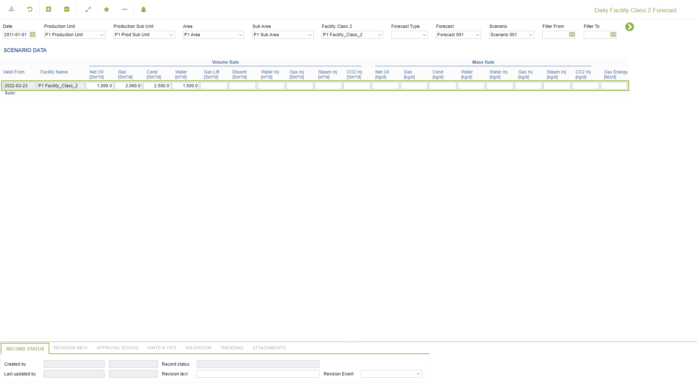

# PP.0064 - Daily Facility Class 2 Forecast

_Deep-dive 2026-07-06 (deterministic runner). Module: PP._

## Identity
- BF_CODE: PP.0064 - URL: `/com.ec.prod.pp.screens/daily_forecast/TARGETMANDATORY/parent/GROUPMODEL/FCTY_CLASS_2/TARGET/FCTY_CLASS_2/CLASS_NAME/FCST_FCTY2_DAY_STATUS`

## DB binding (metadata-resolved)
| Class | Type/Scope | Base table | View |
|---|---|---|---|
| `FCST_FCTY2_DAY_STATUS` | DATA/EVENT | `FCST_FCTY_DAY` | `DV_FCST_FCTY2_DAY_STATUS` |

_Resolved by: url CLASS_NAME_

## Screen type
DATA/EVENT

## Help (screen screenshot -- local online-help corpus 14.2.5)

## Help (field-description images -- local online-help corpus 14.2.5)
_(no field-description images in corpus for this BF_CODE)_
