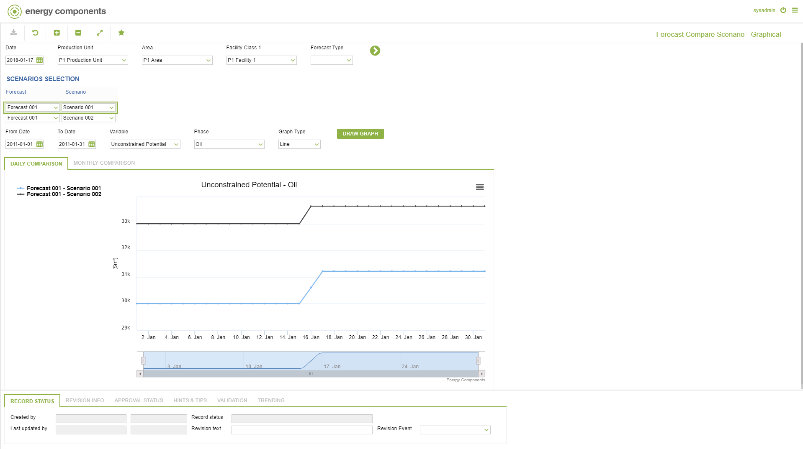
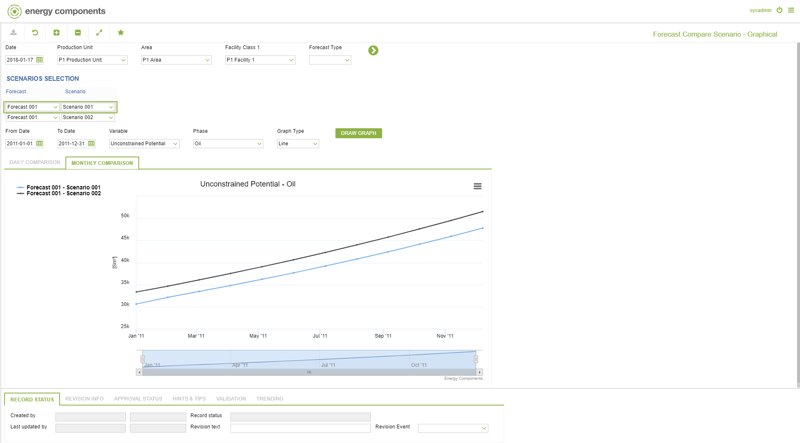

# PP.0066 - Forecast Compare Scenario - Graphical

_Deep-dive 2026-07-06 (deterministic runner). Module: PP._

## Identity
- BF_CODE: PP.0066 - URL: `/com.ec.prod.pp.screens/forecast_scenarios_graphs/CLASS_NAME/FCST_SCENARIO_GRAPHS/DAILY_CLASS_NAME/FCST_SUMM_VAR_DAY/MONTHLY_CLASS_NAME/FCST_SUMM_VAR_MTH`

## DB binding (metadata-resolved)
| Class | Type/Scope | Base table | View |
|---|---|---|---|
| `FCST_SCENARIO_GRAPHS` | TABLE/EVENT | `FCST_SCENARIO_GRAPHS` | `TV_FCST_SCENARIO_GRAPHS` |
| `FCST_SUMM_VAR_DAY` | TABLE/EVENT | `V_FCST_SUMM_VAR_DAY` | `TV_FCST_SUMM_VAR_DAY` |
| `FCST_SUMM_VAR_MTH` | TABLE/EVENT | `V_FCST_SUMM_VAR_MTH` | `TV_FCST_SUMM_VAR_MTH` |

_Resolved by: url CLASS_NAME_

## Screen type
TV (table-class)

## Help (screen screenshot -- local online-help corpus 14.2.5)

## Help (field-description images -- local online-help corpus 14.2.5)
_(no field-description images in corpus for this BF_CODE)_
