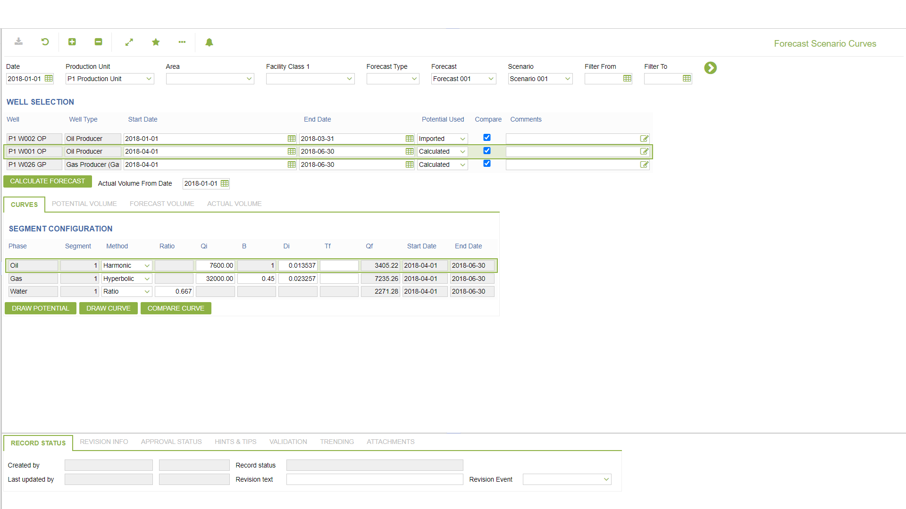
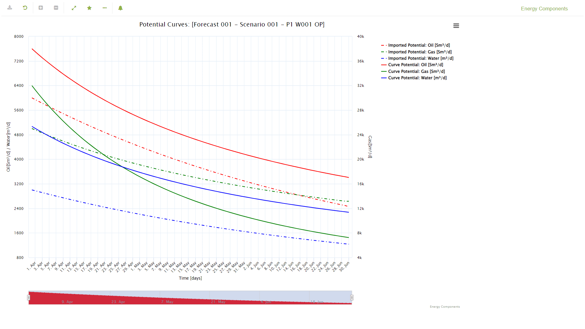
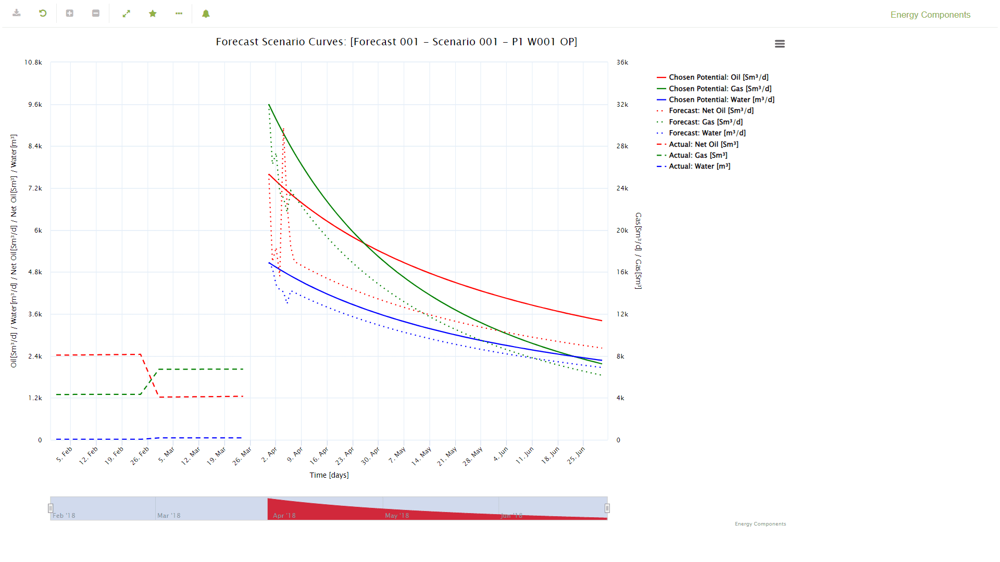
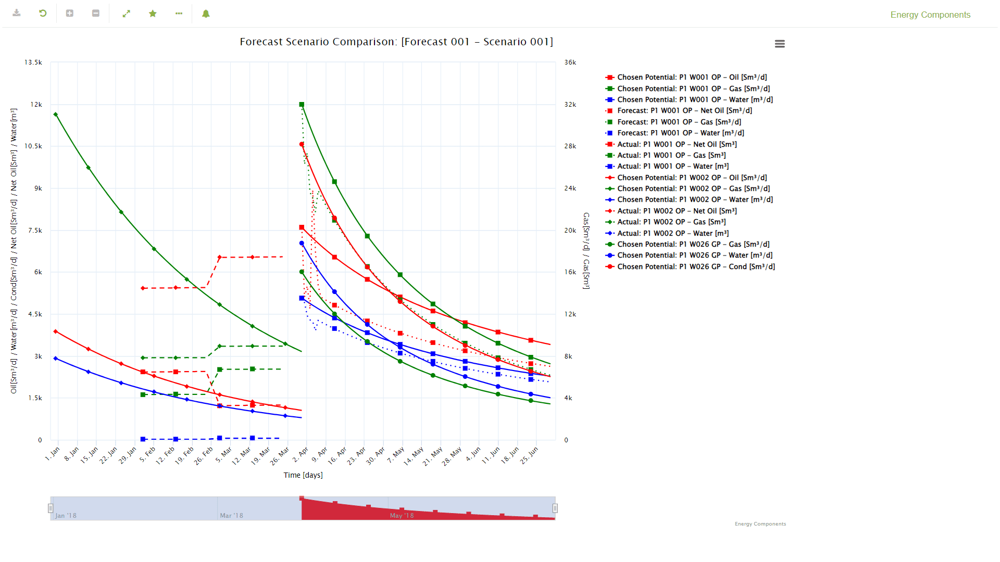

# PP.0068 - Forecast Scenario Curves

_Deep-dive 2026-07-06 (deterministic runner). Module: PP._

## Identity
- BF_CODE: PP.0068 - URL: `/com.ec.prod.pp.screens/forecast_scenarios_curves/CLASS_NAME/FCST_CURVE/CLASS_NAME_1/FCST_CURVE_SEGMENT/CLASS_NAME_2/FCST_VOLUME/CLASS_NAME_3/FCST_POTENTIAL_VOLUME/CLASS_NAME_4/FCST_ACTUAL_VOLUME`

## DB binding (metadata-resolved)
| Class | Type/Scope | Base table | View |
|---|---|---|---|
| `FCST_CURVE` | TABLE/EVENT | `FCST_PROD_CURVES` | `TV_FCST_CURVE` |
| `FCST_CURVE_SEGMENT` | TABLE/EVENT | `FCST_PROD_CURVES_SEGMENT` | `TV_FCST_CURVE_SEGMENT` |
| `FCST_VOLUME` | DATA/DAY | `FCST_PWEL_DAY` | `DV_FCST_VOLUME` |
| `FCST_POTENTIAL_VOLUME` | DATA/EVENT | `FCST_WELL_POTENTIAL` | `DV_FCST_POTENTIAL_VOLUME` |
| `FCST_ACTUAL_VOLUME` | TABLE/EVENT | `PWEL_DAY_ALLOC` | `TV_FCST_ACTUAL_VOLUME` |

_Resolved by: url CLASS_NAME_

## Screen type
TV (table-class)

## Help (screen screenshot -- local online-help corpus 14.2.5)

## Help (field-description images -- local online-help corpus 14.2.5)
_(no field-description images in corpus for this BF_CODE)_
