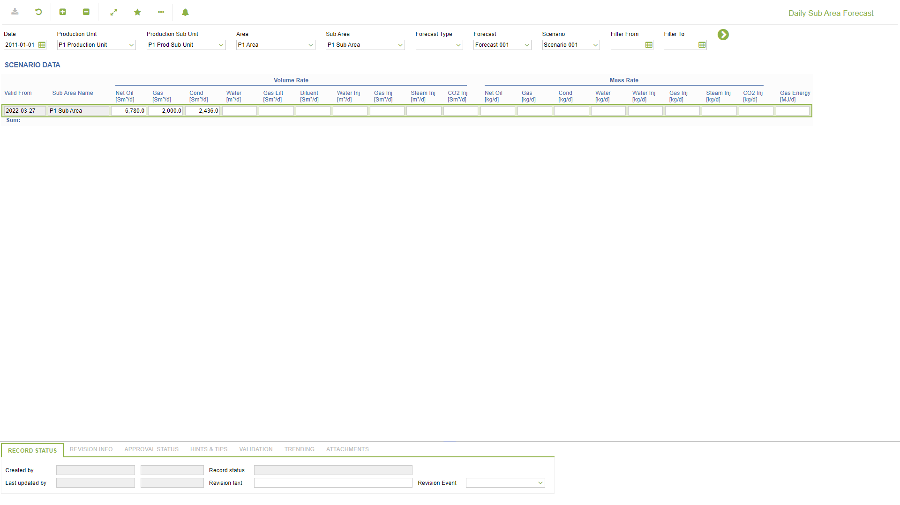

# PP.0069 - Daily Sub Area Forecast

_Deep-dive 2026-07-06 (deterministic runner). Module: PP._

## Identity
- BF_CODE: PP.0069 - URL: `/com.ec.prod.pp.screens/daily_forecast/TARGETMANDATORY/parent/GROUPMODEL/SUB_AREA/TARGET/SUB_AREA/CLASS_NAME/FCST_SUB_AREA_DAY_STATUS`

## DB binding (metadata-resolved)
| Class | Type/Scope | Base table | View |
|---|---|---|---|
| `FCST_SUB_AREA_DAY_STATUS` | DATA/DAY | `FCST_SUB_AREA_DAY` | `DV_FCST_SUB_AREA_DAY_STATUS` |

_Resolved by: url CLASS_NAME_

## Screen type
N1 daily-status grid

## Help (screen screenshot -- local online-help corpus 14.2.5)

## Help (field-description images -- local online-help corpus 14.2.5)
_(no field-description images in corpus for this BF_CODE)_
