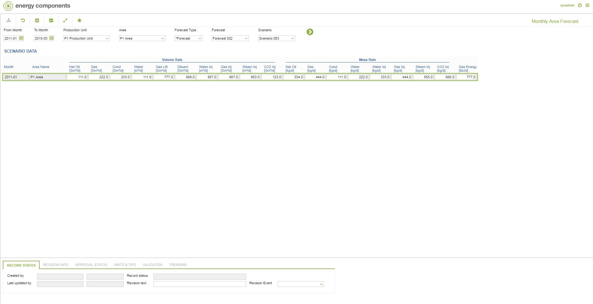

# PP.0072 - Monthly Area Forecast

_Deep-dive 2026-07-06 (deterministic runner). Module: PP._

## Identity
- BF_CODE: PP.0072 - URL: `/com.ec.prod.pp.screens/monthly_forecast_parent/GROUPMODEL/AREA/TARGET/AREA/CLASS_NAME/FCST_AREA_MTH_STATUS`

## DB binding (metadata-resolved)
| Class | Type/Scope | Base table | View |
|---|---|---|---|
| `FCST_AREA_MTH_STATUS` | DATA/MTH | `FCST_AREA_MTH` | `DV_FCST_AREA_MTH_STATUS` |

_Resolved by: url CLASS_NAME_

## Screen type
DATA/MTH

## Help (screen screenshot -- local online-help corpus 14.2.5)

## Help (field-description images -- local online-help corpus 14.2.5)
_(no field-description images in corpus for this BF_CODE)_
