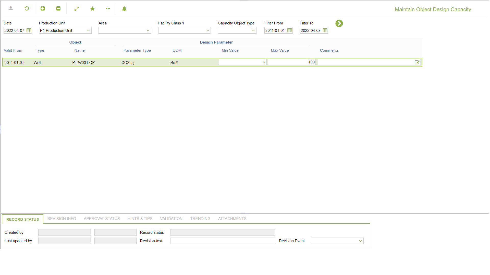

# PP.0077 - Maintain Object Design Capacity

_Deep-dive 2026-07-06 (deterministic runner). Module: PP._

## Identity
- BF_CODE: PP.0077 - URL: `/com.ec.prod.pp.screens/maintain_object_design_capacity/CLASS_NAME/OBJECT_DESIGN_PARAM_CAP`

## DB binding (metadata-resolved)
| Class | Type/Scope | Base table | View |
|---|---|---|---|
| `OBJECT_DESIGN_PARAM_CAP` | TABLE/EVENT | `OBJECT_DESIGN_PARAM_CAP` | `TV_OBJECT_DESIGN_PARAM_CAP` |

_Resolved by: url CLASS_NAME_

## Screen type
TV (table-class)

## Help (screen screenshot -- local online-help corpus 14.2.5)

## Help (field-description images -- local online-help corpus 14.2.5)
_(no field-description images in corpus for this BF_CODE)_
