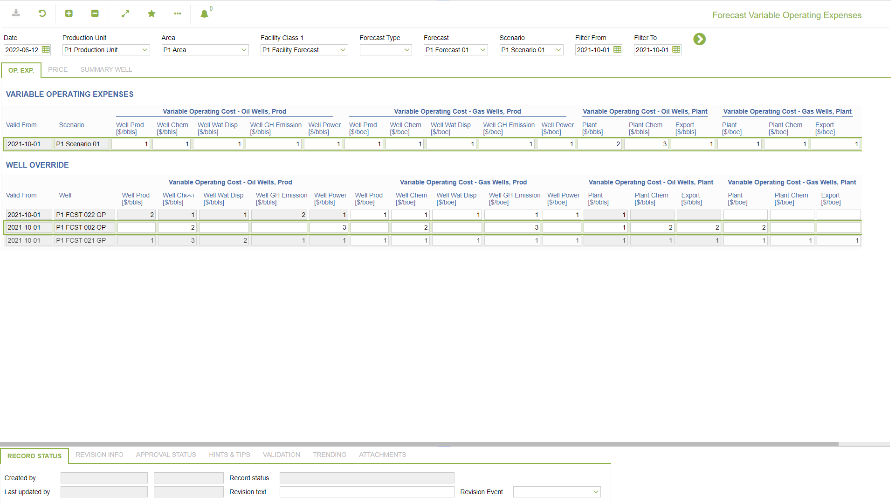
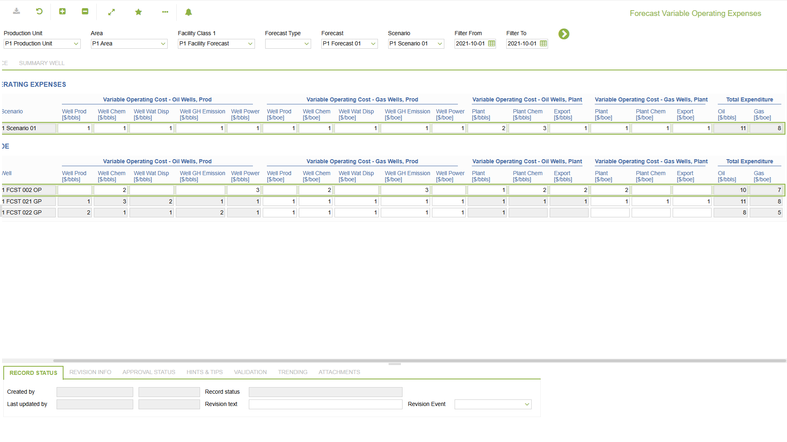
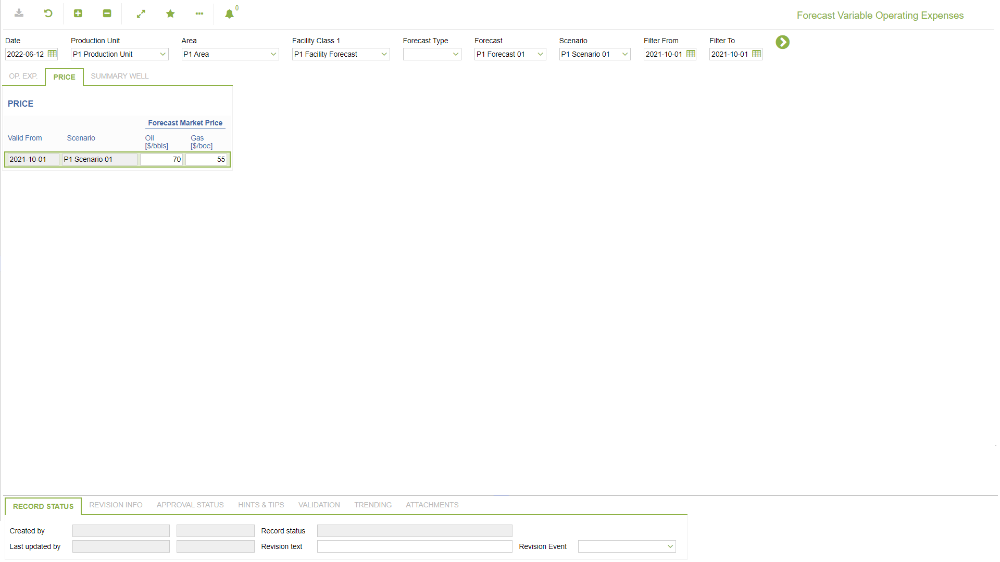
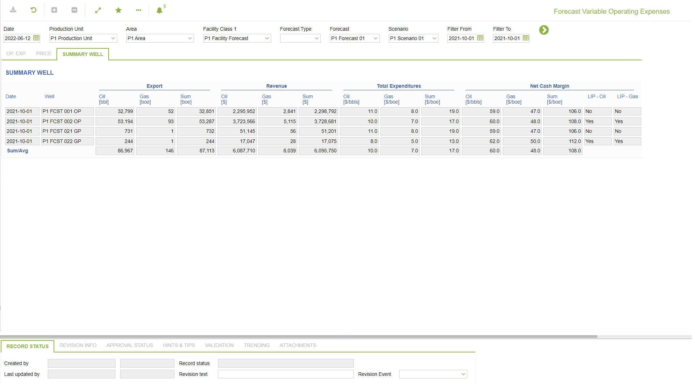
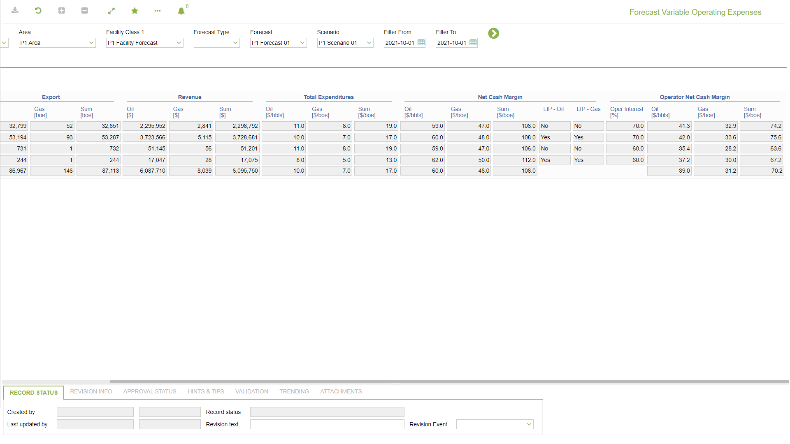

# PP.0079 - Forecast Variable Operating Expenses

_Deep-dive 2026-07-06 (deterministic runner). Module: PP._

## Identity
- BF_CODE: PP.0079 - URL: `/com.ec.prod.pp.screens/fcst_var_oprtng_expnses/TARGETMANDATORY/parent/CLASS_NAME_1/FCST_OP_EXP/CLASS_NAME_2/FCST_WELL_OVRD/CLASS_NAME_3/FCST_MARKET_PRICE/CLASS_NAME_4/FCST_VAR_SUMM_WELL`

## DB binding (metadata-resolved)
| Class | Type/Scope | Base table | View |
|---|---|---|---|
| `FCST_OP_EXP` | DATA/EVENT | `FCST_OP_EXP` | `DV_FCST_OP_EXP` |
| `FCST_WELL_OVRD` | DATA/EVENT | `FCST_WELL_OVRD` | `DV_FCST_WELL_OVRD` |
| `FCST_MARKET_PRICE` | DATA/EVENT | `FCST_MARKET_PRICE` | `DV_FCST_MARKET_PRICE` |
| `FCST_VAR_SUMM_WELL` | DATA/EVENT | `V_FCST_VAR_SUMM_WELL` | `DV_FCST_VAR_SUMM_WELL` |

_Resolved by: url CLASS_NAME_

## Screen type
DATA/EVENT

## Help (screen screenshot -- local online-help corpus 14.2.5)

## Help (field-description images -- local online-help corpus 14.2.5)
_(no field-description images in corpus for this BF_CODE)_
