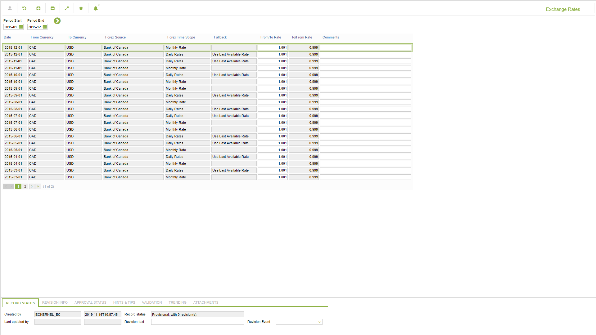

# PR.0003 - Exchange Rates

_Deep-dive 2026-07-06 (deterministic runner). Module: PR._

## Identity
- BF_CODE: PR.0003 - URL: `/com.ec.sale.pr.screens/exchange_rates`

## DB binding (metadata-resolved)
| Class | Type/Scope | Base table | View |
|---|---|---|---|
| `EXCHANGE_RATE` | DATA/MTH | `CURRENCY_EXCHANGE` | `DV_EXCHANGE_RATE` |

_Resolved by: url path token_

## Screen type
DATA/MTH

## Help (screen screenshot -- local online-help corpus 14.2.5)

## Help (field-description images -- local online-help corpus 14.2.5)
_(no field-description images in corpus for this BF_CODE)_
