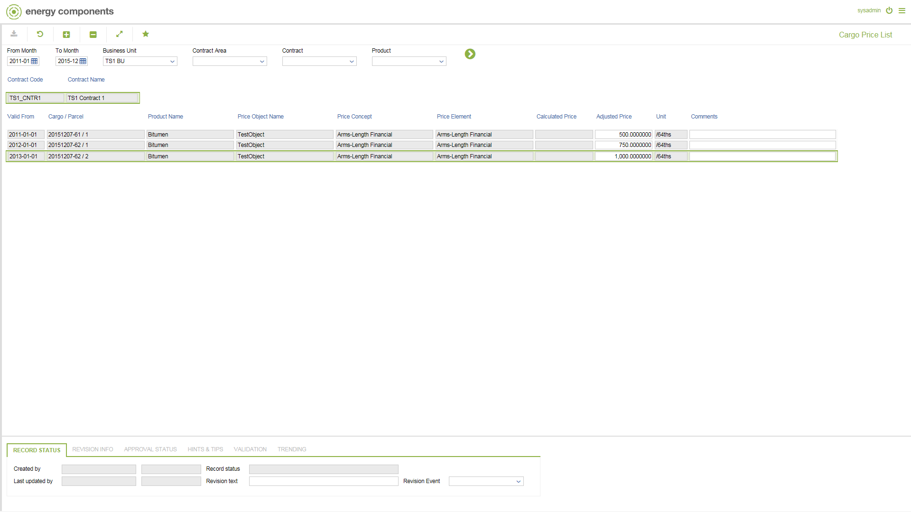

# PR.0010 - Cargo Price List

_Deep-dive 2026-07-06 (deterministic runner). Module: PR._

## Identity
- BF_CODE: PR.0010 - URL: `/com.ec.sale.pr.screens/cargo_price_list`

## DB binding (metadata-resolved)
| Class | Type/Scope | Base table | View |
|---|---|---|---|
| `CARGO_PRICE_LIST` | DATA/EVENT | `PRODUCT_PRICE_VALUE` | `DV_CARGO_PRICE_LIST` |

_Resolved by: url path token_

## Screen type
DATA/EVENT

## Help (screen screenshot -- local online-help corpus 14.2.5)

## Help (field-description images -- local online-help corpus 14.2.5)
_(no field-description images in corpus for this BF_CODE)_
