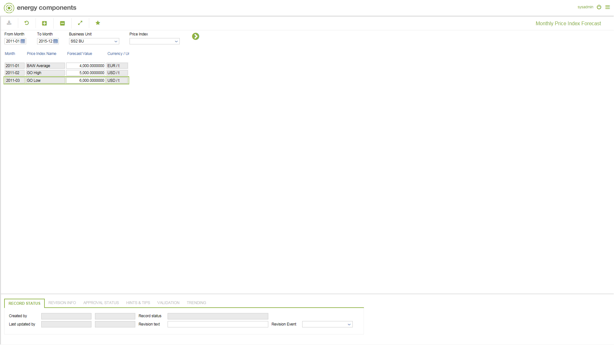

# PR.0011 - Monthly Price Index Forecast

_Deep-dive 2026-07-06 (deterministic runner). Module: PR._

## Identity
- BF_CODE: PR.0011 - URL: `/com.ec.sale.pr.screens/price_index_monthly_forecast`

## DB binding (metadata-resolved)
| Class | Type/Scope | Base table | View |
|---|---|---|---|
| `PRICE_INDEX_MTH_FC_VAL` | DATA/MTH | `PRICE_INDEX_FC_VALUE` | `DV_PRICE_INDEX_MTH_FC_VAL` |

_Resolved by: label (exact, unique)_

## Screen type
DATA/MTH

## Help (screen screenshot -- local online-help corpus 14.2.5)

## Help (field-description images -- local online-help corpus 14.2.5)
_(no field-description images in corpus for this BF_CODE)_
