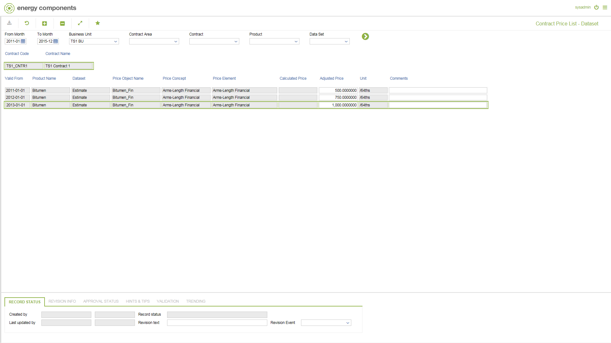

# PR.0020 - Contract Price List - Dataset

_Deep-dive 2026-07-06 (deterministic runner). Module: PR._

## Identity
- BF_CODE: PR.0020 - URL: `/com.ec.sale.pr.screens/contract_price_list_with_dim/CLASS/CONTRACT_PRICE_DS_LIST`

## DB binding (metadata-resolved)
| Class | Type/Scope | Base table | View |
|---|---|---|---|
| `CONTRACT_PRICE_DS_LIST` | DATA/EVENT | `PRODUCT_PRICE_DIM1_VALUE` | `DV_CONTRACT_PRICE_DS_LIST` |

_Resolved by: url path token_

## Screen type
DATA/EVENT

## Help (screen screenshot -- local online-help corpus 14.2.5)

## Help (field-description images -- local online-help corpus 14.2.5)
_(no field-description images in corpus for this BF_CODE)_
