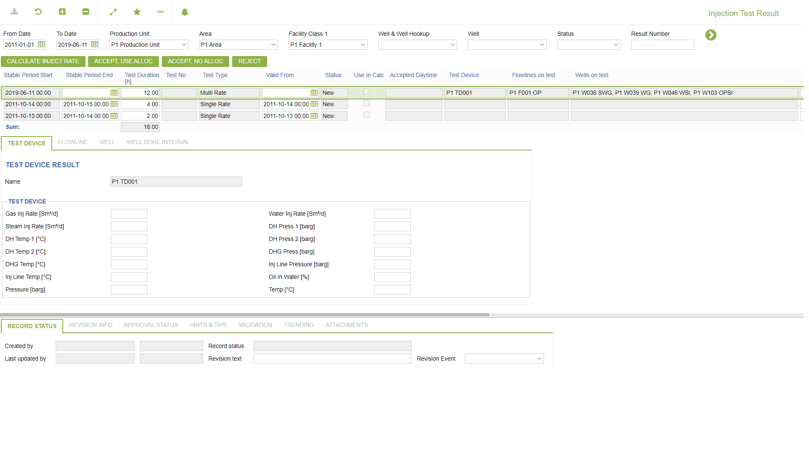
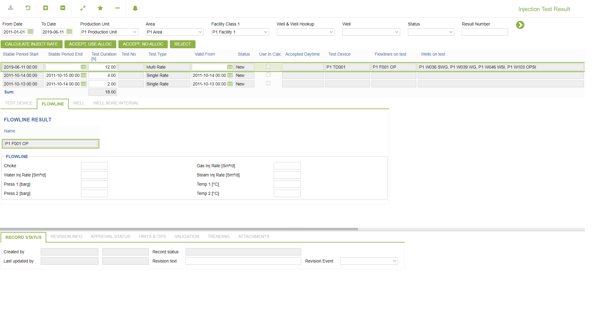
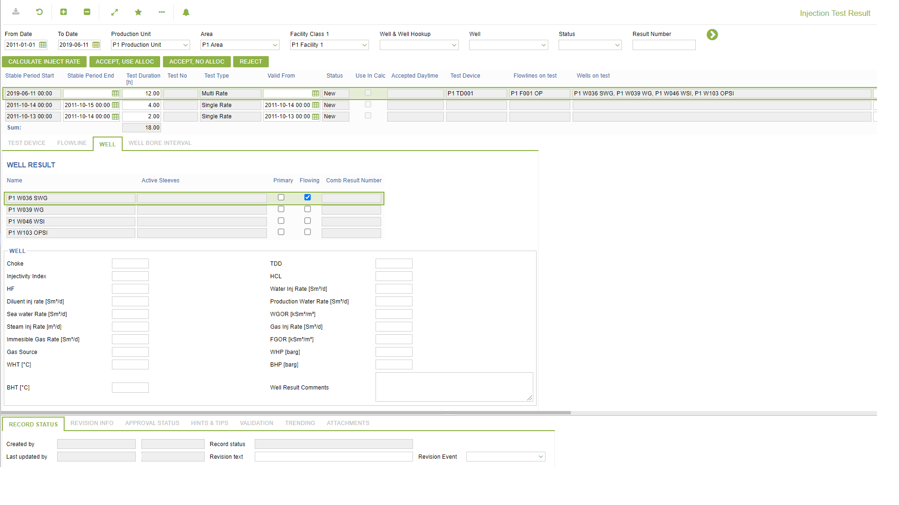
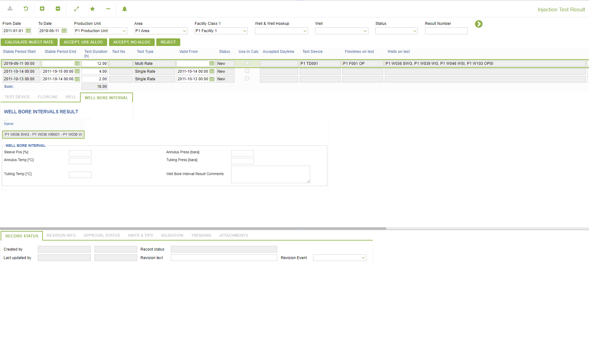

# PT.0023 - Injection Test Result

_Deep-dive 2026-07-06 (deterministic runner). Module: PT._

## Identity
- BF_CODE: PT.0023 - URL: `/com.ec.prod.pt.screens/inj_test_result`

## DB binding (metadata-resolved)
| Class | Type/Scope | Base table | View |
|---|---|---|---|
| `INJ_TEST_RESULT` | TABLE/EVENT | `ITST_RESULT` | `TV_INJ_TEST_RESULT` |

_Resolved by: url path token_

## Screen type
TV (table-class)

## Help (screen screenshot -- local online-help corpus 14.2.5)

## Help (field-description images -- local online-help corpus 14.2.5)
_(no field-description images in corpus for this BF_CODE)_
