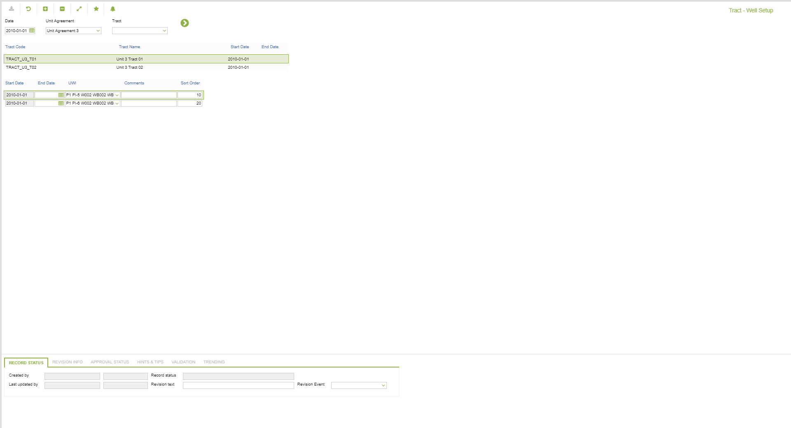

# RC.0057 - Tract - Well Setup

_Deep-dive 2026-07-07 (deterministic runner). Module: RC._

## Identity
- BF_CODE: RC.0057 - URL: `/com.ec.revn.rty/well_setup/CLASS_NAME/TRACT/DATA_CLASS/TRACT_WELL_SETUP/NAVMODEL/WELL_SETUP/TARGET/TRACT`

## DB binding (metadata-resolved)
| Class | Type/Scope | Base table | View |
|---|---|---|---|
| `TRACT` | OBJECT/VERSIONED | `TRACT` | `OV_TRACT` |

_Resolved by: url CLASS_NAME_

## Screen type
OV (master-data object)

## Help (screen screenshot -- local online-help corpus 14.2.5)

## Help (field-description images -- local online-help corpus 14.2.5)
_(no field-description images in corpus for this BF_CODE)_
