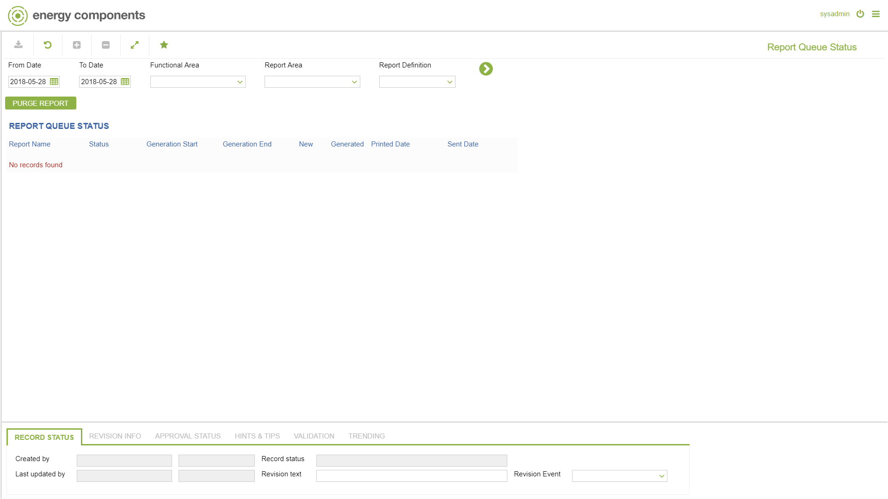

# RP.0006 - Report Queue Status

_Deep-dive 2026-07-06 (deterministic runner). Module: RP._

## Identity
- BF_CODE: RP.0006 - URL: `/com.ec.frmw.report.screens/report_queue_status`

## DB binding (metadata-resolved)
| Class | Type/Scope | Base table | View |
|---|---|---|---|
| `REPORT_QUEUE_STATUS` | TABLE/EVENT | `REPORT` | `TV_REPORT_QUEUE_STATUS` |

_Resolved by: url path token_

## Screen type
TV (table-class)

## Help (screen screenshot -- local online-help corpus 14.2.5)

## Help (field-description images -- local online-help corpus 14.2.5)
_(no field-description images in corpus for this BF_CODE)_
