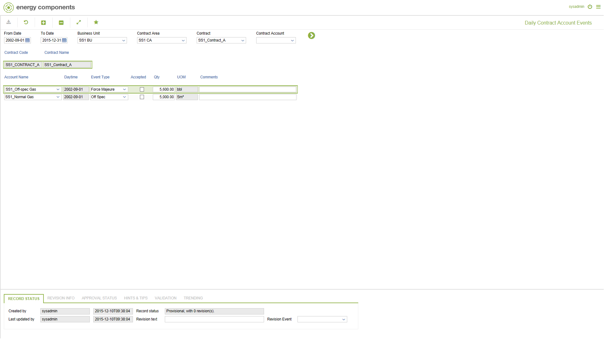

# SA.0008 - Daily Contract Account Events

_Deep-dive 2026-07-06 (deterministic runner). Module: SA._

## Identity
- BF_CODE: SA.0008 - URL: `/com.ec.sale.sa.screens/daily_contract_account_events`

## DB binding (metadata-resolved)
| Class | Type/Scope | Base table | View |
|---|---|---|---|
| `SCTR_ACC_DAY_EVENT` | DATA/DAY | `CNTR_ACCOUNT_EVENT` | `DV_SCTR_ACC_DAY_EVENT` |

_Resolved by: label (exact, unique)_

## Screen type
N1 daily-status grid

## Help (screen screenshot -- local online-help corpus 14.2.5)

## Help (field-description images -- local online-help corpus 14.2.5)
_(no field-description images in corpus for this BF_CODE)_
