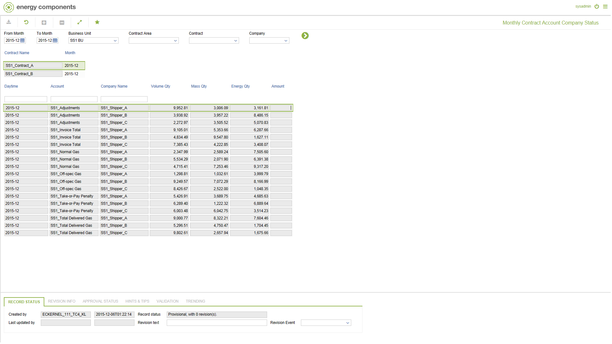

# SA.0018 - Monthly Contract Account Company Status

_Deep-dive 2026-07-06 (deterministic runner). Module: SA._

## Identity
- BF_CODE: SA.0018 - URL: `/com.ec.sale.sa.screens/contract_account_company_status_monthly`

## DB binding (metadata-resolved)
| Class | Type/Scope | Base table | View |
|---|---|---|---|
| `SCTR_ACC_MTH_CPY_STATUS` | DATA/MTH | `CNTRACC_PER_CPY_STATUS` | `DV_SCTR_ACC_MTH_CPY_STATUS` |

_Resolved by: label (exact, unique)_

## Screen type
DATA/MTH

## Help (screen screenshot -- local online-help corpus 14.2.5)

## Help (field-description images -- local online-help corpus 14.2.5)
_(no field-description images in corpus for this BF_CODE)_
