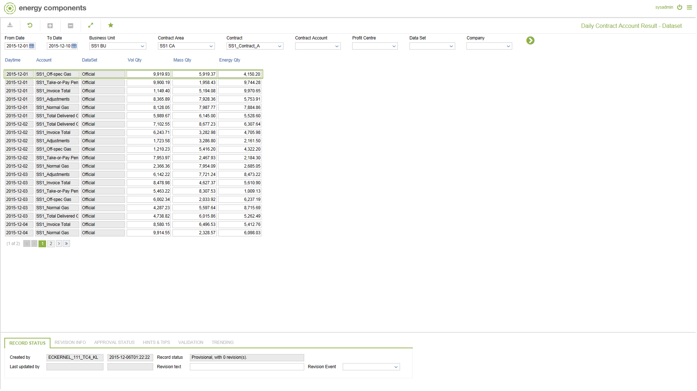

# SA.0019.DS - Daily Contract Account Result - Dataset

_Deep-dive 2026-07-06 (deterministic runner). Module: SA._

## Identity
- BF_CODE: SA.0019.DS - URL: `/com.ec.sale.sa.screens/daily_contract_calc_result/BF_PROFILE/SA.0019.DS/CLASS/SCTR_ACC_DAY_DS_ALLOC`

## DB binding (metadata-resolved)
| Class | Type/Scope | Base table | View |
|---|---|---|---|
| `SCTR_ACC_DAY_DS_ALLOC` | DATA/DAY | `CNTRACC_PER_DIM1_ALLOC` | `DV_SCTR_ACC_DAY_DS_ALLOC` |

_Resolved by: url path token_

## Screen type
N1 daily-status grid

## Help (screen screenshot -- local online-help corpus 14.2.5)

## Help (field-description images -- local online-help corpus 14.2.5)
_(no field-description images in corpus for this BF_CODE)_
