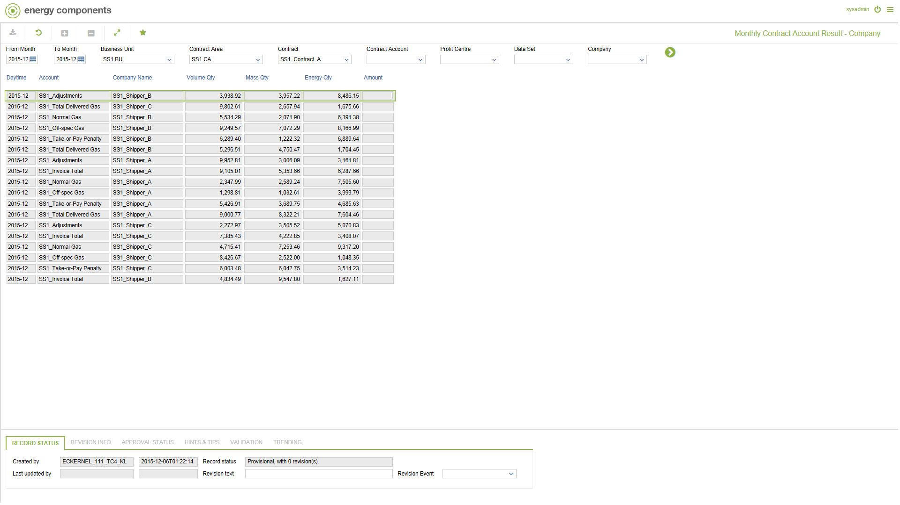

# SA.0020.CPY - Monthly Contract Account Result - Company

_Deep-dive 2026-07-06 (deterministic runner). Module: SA._

## Identity
- BF_CODE: SA.0020.CPY - URL: `/com.ec.sale.sa.screens/monthly_contract_calc_result/BF_PROFILE/SA.0020.CPY/CLASS/SCTR_ACC_MTH_CPY_STATUS`

## DB binding (metadata-resolved)
| Class | Type/Scope | Base table | View |
|---|---|---|---|
| `SCTR_ACC_MTH_CPY_STATUS` | DATA/MTH | `CNTRACC_PER_CPY_STATUS` | `DV_SCTR_ACC_MTH_CPY_STATUS` |

_Resolved by: url path token_

## Screen type
DATA/MTH

## Help (screen screenshot -- local online-help corpus 14.2.5)

## Help (field-description images -- local online-help corpus 14.2.5)
_(no field-description images in corpus for this BF_CODE)_
