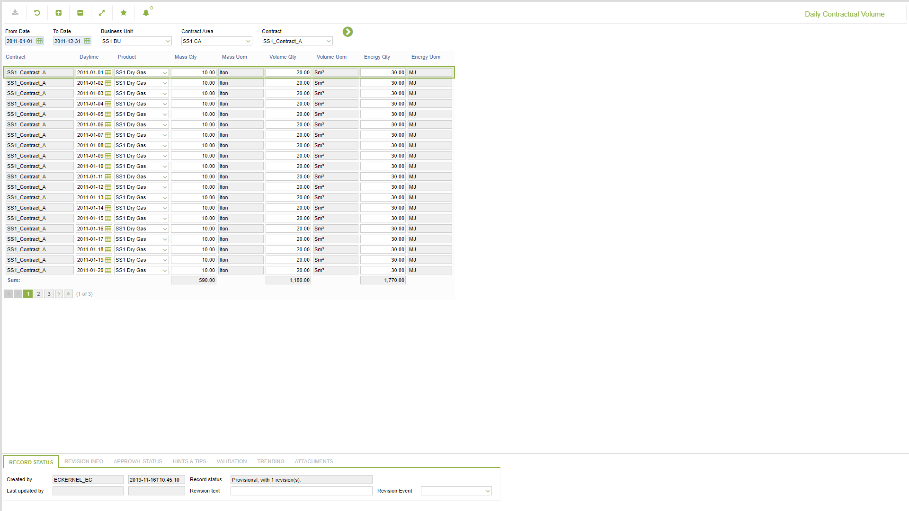

# SA.0037 - Daily Contractual Volume

_Deep-dive 2026-07-06 (deterministic runner). Module: SA._

## Identity
- BF_CODE: SA.0037 - URL: `/com.ec.tran.gd.screens/period_day_np_data/CLASS/SLCN_DAY_PRODUCT_QTY/NAV_MODEL/SALE_COMMERCIAL/TARGET/CONTRACT/BF_PROFILE/SA.0037`

## DB binding (metadata-resolved)
| Class | Type/Scope | Base table | View |
|---|---|---|---|
| `SLCN_DAY_PRODUCT_QTY` | DATA/DAY | `CNTR_DIM1_PERIOD_STATUS` | `DV_SLCN_DAY_PRODUCT_QTY` |

_Resolved by: label (exact, unique)_

## Screen type
N1 daily-status grid

## Help (screen screenshot -- local online-help corpus 14.2.5)

## Help (field-description images -- local online-help corpus 14.2.5)
_(no field-description images in corpus for this BF_CODE)_
