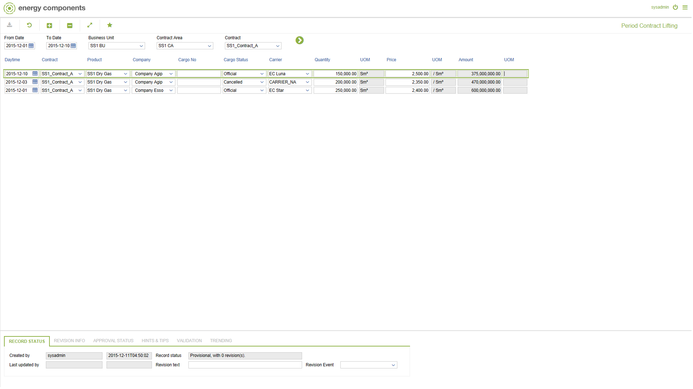

# SA.0039 - Period Contract Lifting

_Deep-dive 2026-07-06 (deterministic runner). Module: SA._

## Identity
- BF_CODE: SA.0039 - URL: `/com.ec.sale.sa.screens/period_contract_lifting/CLASS/SCTR_DAY_LIFTING/NAV_MODEL/SALE_COMMERCIAL/TARGET/CONTRACT/BF_PROFILE/SA.0039`

## DB binding (metadata-resolved)
| Class | Type/Scope | Base table | View |
|---|---|---|---|
| `SCTR_DAY_LIFTING` | DATA/EVENT | `SCTR_DAY_LIFTING` | `DV_SCTR_DAY_LIFTING` |

_Resolved by: label (exact, unique)_

## Screen type
DATA/EVENT

## Help (screen screenshot -- local online-help corpus 14.2.5)

## Help (field-description images -- local online-help corpus 14.2.5)
_(no field-description images in corpus for this BF_CODE)_
