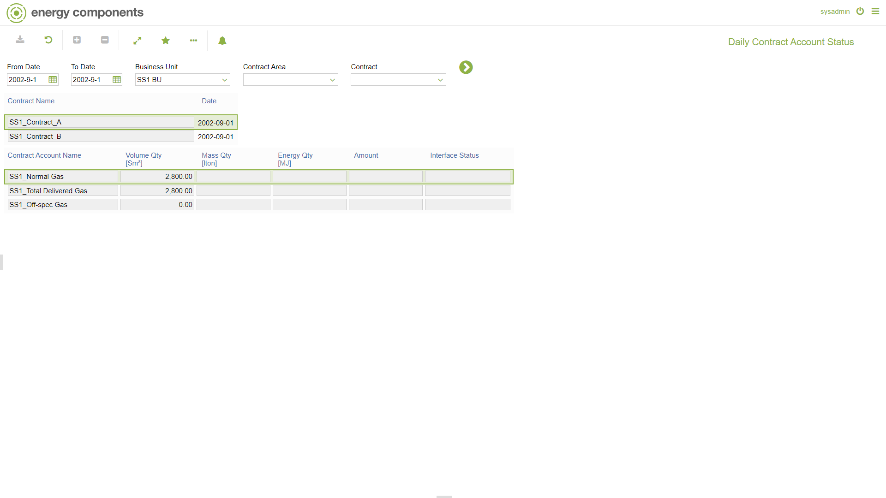

# SA.0040 - Daily Contract Account Status

_Deep-dive 2026-07-06 (deterministic runner). Module: SA._

## Identity
- BF_CODE: SA.0040 - URL: `/com.ec.sale.sa.screens/contract_account_status/TYPE/STD/TIME_SPAN/DAY`

## DB binding (metadata-resolved)
| Class | Type/Scope | Base table | View |
|---|---|---|---|
| `FCST_MAN_CNTRACC_STATUS` | DATA/EVENT | `CNTR_ACC_PERIOD_STATUS` | `DV_FCST_MAN_CNTRACC_STATUS` |

_Resolved by: label (exact, unique)_

## Screen type
DATA/EVENT

## Help (screen screenshot -- local online-help corpus 14.2.5)

## Help (field-description images -- local online-help corpus 14.2.5)
_(no field-description images in corpus for this BF_CODE)_
