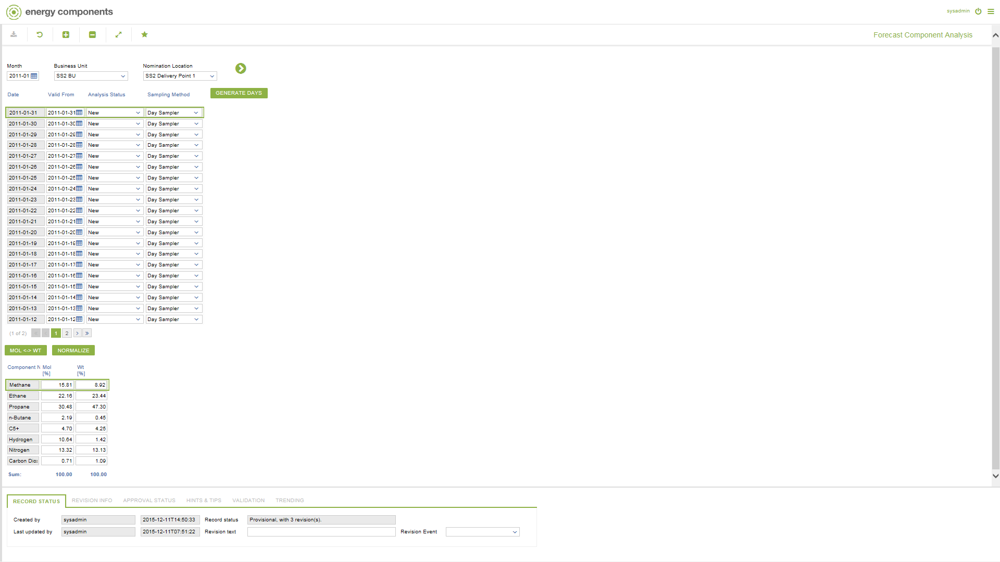

# SD.0010 - Forecast Component Analysis

_Deep-dive 2026-07-06 (deterministic runner). Module: SD._

## Identity
- BF_CODE: SD.0010 - URL: `/com.ec.sale.sd.screens/forecast_comp_analysis`

## DB binding (metadata-resolved)
| Class | Type/Scope | Base table | View |
|---|---|---|---|
| `SLNL_FCST_ANALYSIS_COMP` | TABLE/EVENT | `FLUID_ANALYSIS_COMPONENT` | `TV_SLNL_FCST_ANALYSIS_COMP` |

_Resolved by: label (exact, unique)_

## Screen type
TV (table-class)

## Help (screen screenshot -- local online-help corpus 14.2.5)

## Help (field-description images -- local online-help corpus 14.2.5)
_(no field-description images in corpus for this BF_CODE)_
