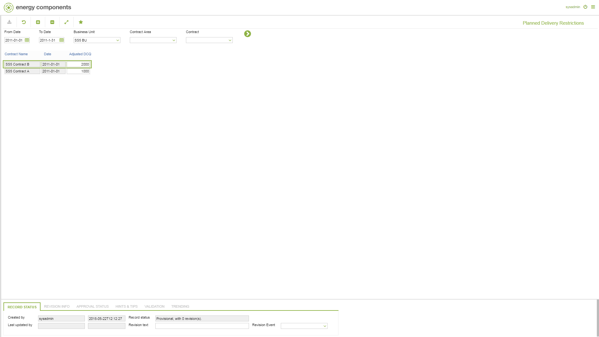

# SD.0012 - Planned Delivery Restrictions

_Deep-dive 2026-07-06 (deterministic runner). Module: SD._

## Identity
- BF_CODE: SD.0012 - URL: `/com.ec.sale.sd.screens/planned_delivery_restrictions`

## DB binding (metadata-resolved)
| Class | Type/Scope | Base table | View |
|---|---|---|---|
| `SCTR_DEL_RESTRICT` | DATA/EVENT | `CNTR_DAY_RESTRICTION` | `DV_SCTR_DEL_RESTRICT` |

_Resolved by: label (exact, unique)_

## Screen type
DATA/EVENT

## Help (screen screenshot -- local online-help corpus 14.2.5)

## Help (field-description images -- local online-help corpus 14.2.5)
_(no field-description images in corpus for this BF_CODE)_
