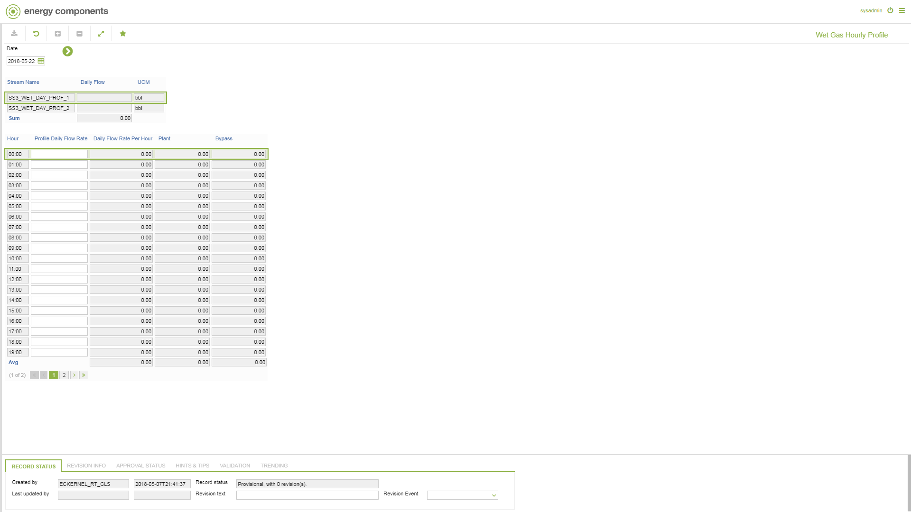

# SD.0015 - Wet Gas Hourly Profile

_Deep-dive 2026-07-06 (deterministic runner). Module: SD._

## Identity
- BF_CODE: SD.0015 - URL: `/com.ec.sale.sd.screens/wet_gas_hourly_profile`

## DB binding (metadata-resolved)
| Class | Type/Scope | Base table | View |
|---|---|---|---|
| `WET_GAS_HOURLY_PROFILE` | TABLE/1HR | `WET_GAS_HOURLY_PROFILE` | `TV_WET_GAS_HOURLY_PROFILE` |

_Resolved by: url path token_

## Screen type
TV (table-class)

## Help (screen screenshot -- local online-help corpus 14.2.5)

## Help (field-description images -- local online-help corpus 14.2.5)
_(no field-description images in corpus for this BF_CODE)_
