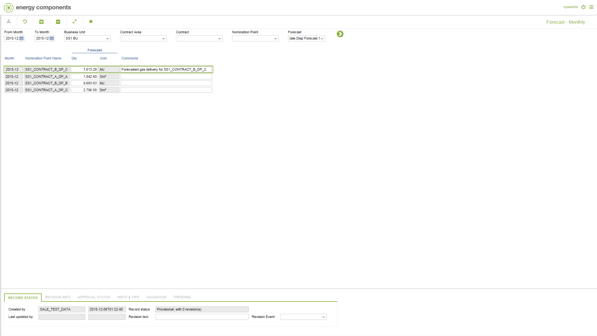

# SD.0031 - Forecast - Monthly

_Deep-dive 2026-07-06 (deterministic runner). Module: SD._

## Identity
- BF_CODE: SD.0031 - URL: `/com.ec.sale.sd.screens/forecast_nompnt_mth_status`

## DB binding (metadata-resolved)
| Class | Type/Scope | Base table | View |
|---|---|---|---|
| `FCST_NOMPNT_MTH_STATUS` | DATA/MTH | `FCST_NOMPNT_MTH_STATUS` | `DV_FCST_NOMPNT_MTH_STATUS` |

_Resolved by: label (exact, unique)_

## Screen type
DATA/MTH

## Help (screen screenshot -- local online-help corpus 14.2.5)

## Help (field-description images -- local online-help corpus 14.2.5)
_(no field-description images in corpus for this BF_CODE)_
