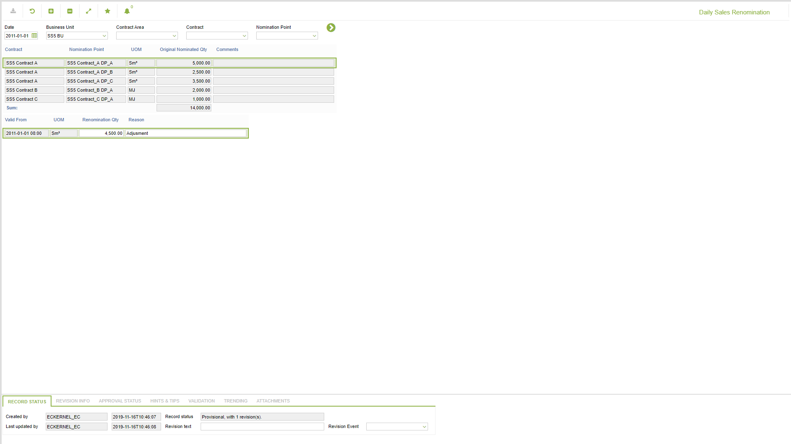

# SD.0050 - Daily Sales Renomination

_Deep-dive 2026-07-06 (deterministic runner). Module: SD._

## Identity
- BF_CODE: SD.0050 - URL: `/com.ec.tran.gd.screens/daily_renomination/NAV_MODEL/SALE_COMMERCIAL/BF_PROFILE/SD.0050/CLASS/SLNP_DAY_RENOM_LIST/CLASS_SUB/SLNP_DAY_RENOMINATION`

## DB binding (metadata-resolved)
| Class | Type/Scope | Base table | View |
|---|---|---|---|
| `SLNP_DAY_RENOMINATION` | DATA/DAY | `NOMPNT_DAY_NOMINATION` | `DV_SLNP_DAY_RENOMINATION` |

_Resolved by: url path token_

## Screen type
N1 daily-status grid

## Help (screen screenshot -- local online-help corpus 14.2.5)

## Help (field-description images -- local online-help corpus 14.2.5)
_(no field-description images in corpus for this BF_CODE)_
