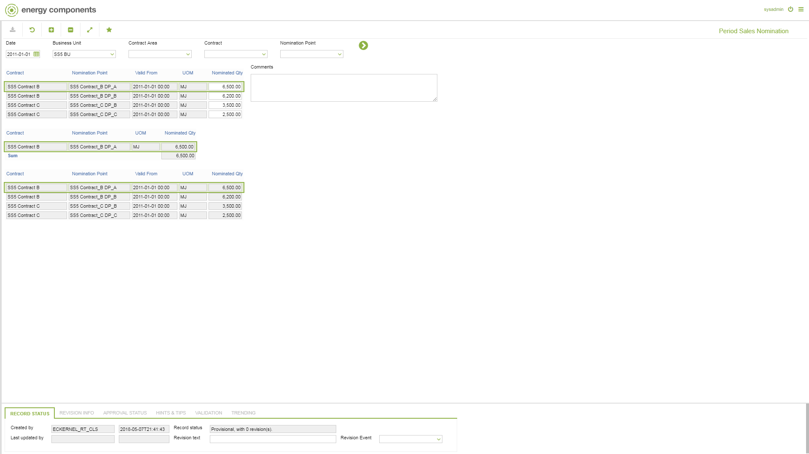

# SD.0051 - Period Sales Nomination

_Deep-dive 2026-07-06 (deterministic runner). Module: SD._

## Identity
- BF_CODE: SD.0051 - URL: `/com.ec.sale.sd.screens/period_sales_nomination/NAV_MODEL/SALE_COMMERCIAL/TARGET/NOMINATION_POINT/BF_PROFILE/SD.0051/CLASS1/SLNP_PERIOD_NOMINATION/CLASS2/SLFA_NOM_COMMENT/CLASS3/SLNP_PERIOD_NOM_LOCATION/CLASS4/SLNP_PERIOD_RENOMINATION`

## DB binding (metadata-resolved)
| Class | Type/Scope | Base table | View |
|---|---|---|---|
| `SLNP_PERIOD_RENOMINATION` | DATA/DAY | `NOMPNT_DAY_NOMINATION` | `DV_SLNP_PERIOD_RENOMINATION` |

_Resolved by: url path token_

## Screen type
N1 daily-status grid

## Help (screen screenshot -- local online-help corpus 14.2.5)

## Help (field-description images -- local online-help corpus 14.2.5)
_(no field-description images in corpus for this BF_CODE)_
